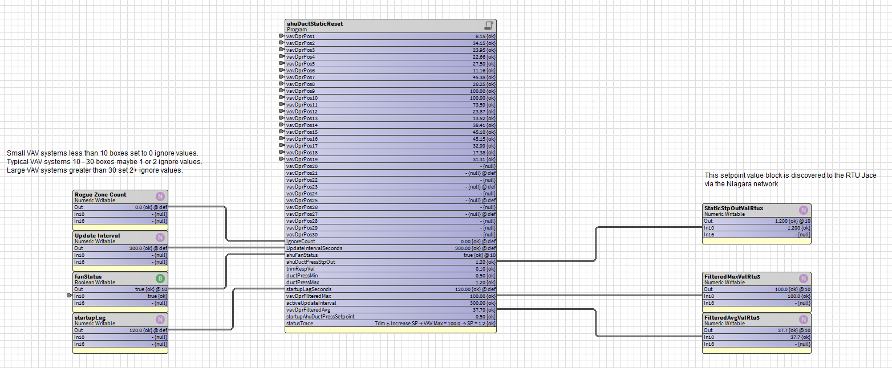
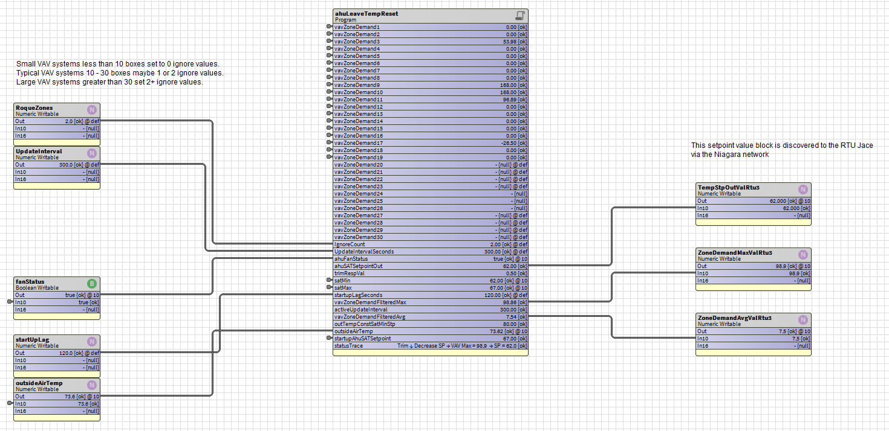
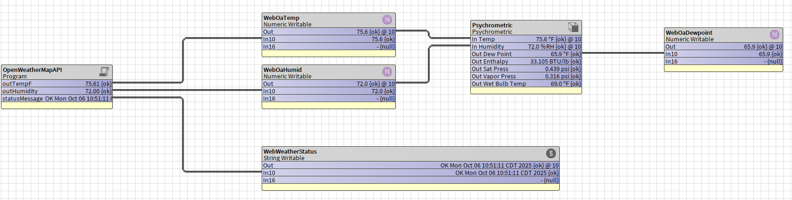
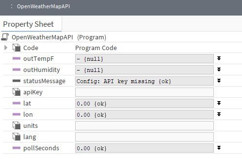
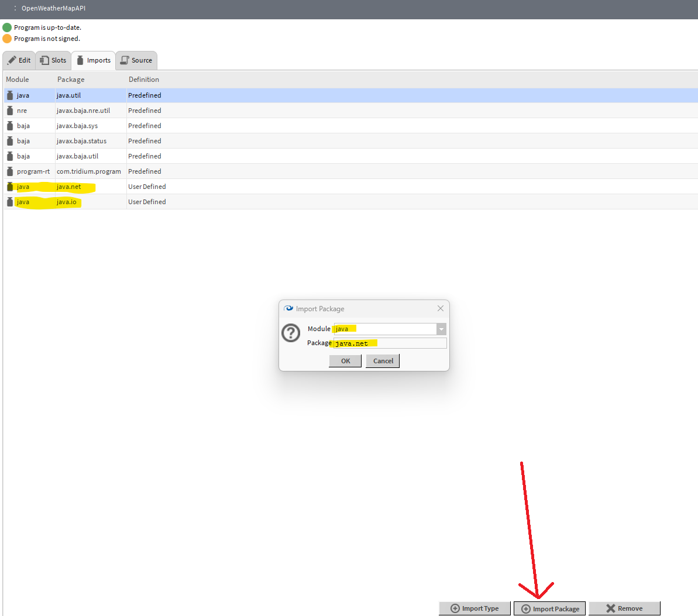
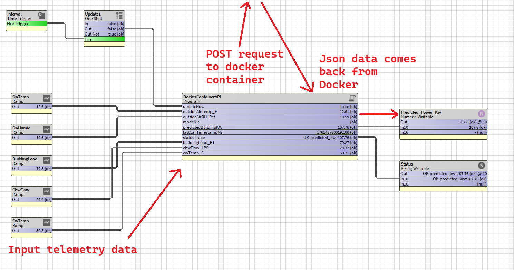

# niagara4-vibe-code-addict


This repo delivers the latest and greatest for those addicted to vibe coding — specifically in Java-based optimization logic for Niagara 4 (N4) control systems. Think of it as a vibe-driven tutorial lab, crafted and tested by Ben. Many of the optimization strategies here take inspiration from ASHRAE Guideline 36, but with practical enhancements to make them deployment-ready for real-world HVAC systems.

[🎥 Talk Shop With Ben on YouTube](https://www.youtube.com/@TalkShopWithBen)

---

## Available Optimization Blocks

This repository includes drop-in Java algorithm blocks for Niagara 4 as `bog` files to use in wire sheet views in Workbench. Download this repo as a zip file or use git directly.

To use:

1. Navigate to your **Workbench → User Home** directory.
2. Copy the `.bog` file from the GitHub repo into this folder.
3. Open the `.bog` file inside Niagara, copy its contents into a running station.
4. Wire in your HVAC input/output points.
5. Drop this README into your LLM prompt or upload it along with your algorithm idea.
6. Ask the LLM if it understands this guide first — this ensures it follows the Niagara-specific programming rules.
7. Provide algorithm ideas — LLMs can help fill in logic inside the onStart, onExecute, and onStop methods.
8. If the LLM generates Java code for imports, class headers, or slot getters/setters — those are auto-generated by Niagara Workbench. Just remind it if it does it by accident and screenshot any Java compile errors back into ChatGPT.

---

<details>
<summary>🧠 AI/LLM's section to read...not required by the human</summary>

This section provides a guide for interacting with AI and LLMs (like ChatGPT) to generate **Niagara 4 Program Object** Java code *safely and correctly*.

Niagara Workbench **auto-generates** important pieces of the Program Object code — do not generate or modify them manually.

---

### **Key Rules for LLM and Human Collaboration**

#### **❌ Do Not Generate or Modify These**

> **LLMs must NOT generate:**
> * Do not insert emoji into code as it will error out the compiling process.
> * Class header and imports.
> * `public class ProgramImpl extends ProgramBase`.
> * Auto-generated slot getter and setter methods.
> * `/* Auto-generated ProgramImpl Code */` sections.

These are **automatically handled** by **Niagara Workbench** — no need to manually import or build the class boilerplate!

**Workbench generates this structure for you**:

```java
/* Auto-generated ProgramImpl Code */

import java.util.*;
import javax.baja.sys.*;
import javax.baja.status.*;
import com.tridium.program.*;

public class ProgramImpl extends ProgramBase {
  
  public void onStart() throws Exception {
    // startup code
  }

  public void onExecute() throws Exception {
    // execute code
  }

  public void onStop() throws Exception {
    // shutdown code
  }
}
```

---

### **✅ What You *Can* Ask LLMs to Generate**

> **Only generate code inside:**
>
> * `onStart()`
> * `onExecute()`
> * `onStop()`
> * Small helper methods (at the class level)

**⚠️ Reminder:**

* Java does **NOT** allow nested methods.
* **Helper functions (like `addIfWired()`) must be at class level**, not inside `onExecute()`.

**Example of what NOT to do** — ❌ **Incorrect**

```java
public void onExecute() throws Exception {
  // this is invalid: 
  double addIfWired(BStatusNumeric input) { 
    ...
  }
}
```

**Correct** — ✅ **Move helper outside**

```java
// Class-level helper
int addIfWired(BStatusNumeric input) {
  if (input.getStatus().isOk()) {
    sum += input.getValue();
    return 1;
  }
  return 0;
}
```

---

### **Internal Timers in Niagara Program Objects**

> **Use Clock.schedule() with a BRelTime object inside a helper method.**

**Example (Correct Timer Logic):**

```java
Clock.Ticket ticket;

void updateTimer() {            
  if (ticket != null) {
    ticket.cancel();
  }  
  // Hardcoded 10-second update interval
  ticket = Clock.schedule(getComponent(), BRelTime.makeSeconds(10), BProgram.execute, null);
}
```

🚫 **Do NOT** expose a writable `executePeriod` slot unless truly necessary —
Just schedule internal periodic execution using `Clock.schedule()` directly!

---

### **Common Mistakes to Avoid**

| Mistake                              | Correction                                                                 |
| ------------------------------------ | -------------------------------------------------------------------------- |
| Generating class headers/imports     | ❌ Leave this to Workbench.                                                 |
| Writing slot getters/setters         | ❌ Workbench auto-generates them based on slot definitions.                 |
| Nesting helper methods               | ❌ Java doesn't allow methods inside methods — move helpers to class level. |
| Generating update intervals as slots | ❌ Hardcode your `BRelTime` interval unless you need configurable timing.   |

---

### **When Humans Provide Slot Names**

If the human provides slot names:

* Use them exactly.
* Access them via `getSlotName()`, e.g., `getIn1().getValue()`.

If no names are provided:

* LLM should propose **reasonable slot names** and show a table.

---

### **Example Slot Table if No Names Provided**

| Slot Name      | Type           | Writable | Description           |
| -------------- | -------------- | -------- | --------------------- |
| `in1`          | BStatusNumeric | Yes      | First numeric input   |
| `in2`          | BStatusNumeric | Yes      | Second numeric input  |
| `outAvg`       | BStatusNumeric | No       | Average value output  |
| `wiredInCount` | BStatusString  | No       | Count of wired inputs |

---

### **How to Work With LLMs**

1. Only paste **method bodies** (`onStart`, `onExecute`, `onStop`) into Workbench.
2. **Compile** the Program Object.
3. **If errors occur:**

   * Screenshot the **error** and **slot sheet**.
   * Share it back with the LLM for correction.

⚡ **Quick Debug Tip:**
Most compile errors come from:

* Slot names mismatching.
* Wrong assumptions about slot types or missing getter methods.

---

### **Good Example Output (Correct)**

```java
public void onStart() throws Exception {
    updateTimer();
}

public void onExecute() throws Exception {
    updateTimer();
    
    sum = 0;
    int wiredCount = 0;

    wiredCount += addIfWired(getIn1());
    wiredCount += addIfWired(getIn2());
    
    getOut().setValue(sum);
    getWiredInCount().setValue("Wired Inputs: " + wiredCount);
}

public void onStop() throws Exception {
    if (ticket != null) {
        ticket.cancel();
    }
}

// ✅ Class-level helper function
int addIfWired(BStatusNumeric input) {
    if (input.getStatus().isOk()) {
        sum += input.getValue();
        return 1;
    }
    return 0;
}
```

---

### **Summary**

> **LLMs:**
>
> * ✅ Only generate *method* code (no imports/class headers).
> * ✅ Keep helper functions *outside* methods.
> * ✅ Use internal `Clock.schedule()` hardcoded intervals unless told otherwise.
>
> **Humans:**
>
> * ✅ Use Workbench to compile.
> * ✅ Screenshot and debug slot sheet + errors if issues arise.

</details>

---

<details>
<summary>🧮 Simple Adder Block (Getting Started Tutorial)</summary>

This program block is a simple **Adder** example designed to help you get comfortable coding your first Niagara **Program Object** blocks in Java. It sums up to 4 numeric inputs (`in1`, `in2`, `in3`, `in4`) and outputs the result.

It also counts how many inputs are *actually wired* and writes the number to a `wiredInCount` slot for debugging or diagnostics.

While this could easily be done with basic Niagara Wire Sheet logic, it’s a perfect first step to move into **Java coding** for Niagara!

---

<p align="center">

</p>

---

### ⚙️ **Inputs**

| Input          | Description                                       | Units                            |
| -------------- | ------------------------------------------------- | -------------------------------- |
| `in1`          | First number to add                               | Numeric (real number)            |
| `in2`          | Second number to add                              | Numeric                          |
| `in3`          | Third number to add                               | Numeric                          |
| `in4`          | Fourth number to add                              | Numeric                          |
| `wiredInCount` | *Status output* showing how many inputs are wired | String (e.g., `Wired Inputs: 3`) |

---

### **Calculation**

1. **Sum the Inputs:**

```
sum = in1 + in2 + in3 + in4
```

2. **Count Wired Inputs:**

It uses `getComponent().getLinks(getComponent().getSlot("inX")).length` to count if something is wired to each input. If not wired, the input is cleared to `NULL`.

---

### **Output**

| Output         | Description                      | Units        |
| -------------- | -------------------------------- | ------------ |
| `out`          | The sum of all wired inputs      | Numeric      |
| `wiredInCount` | Number of inputs currently wired | StatusString |

---

### **Example Code**

```java
Clock.Ticket ticket;  

long lastOnExecuteTicks;

public void onStart() throws Exception {
    updateTimer();
}

public void onExecute() throws Exception {
    updateTimer(); 

    double sum = 0;
    int wiredCount = 0;

    if (getInitOnDelink()) {
        if (getComponent().getLinks(getComponent().getSlot("in1")).length == 0) { 
            getIn1().setValue(0);
            getIn1().setStatus(BStatus.NULL);
        } else {
            wiredCount++;
        }

        if (getComponent().getLinks(getComponent().getSlot("in2")).length == 0) { 
            getIn2().setValue(0);
            getIn2().setStatus(BStatus.NULL);
        } else {
            wiredCount++;
        }

        if (getComponent().getLinks(getComponent().getSlot("in3")).length == 0) { 
            getIn3().setValue(0);
            getIn3().setStatus(BStatus.NULL);
        } else {
            wiredCount++;
        }

        if (getComponent().getLinks(getComponent().getSlot("in4")).length == 0) { 
            getIn4().setValue(0);
            getIn4().setStatus(BStatus.NULL);
        } else {
            wiredCount++;
        }
    }  

    sum = getIn1().getValue() + getIn2().getValue() + getIn3().getValue() + getIn4().getValue();
    
    getOut().setValue(sum);

    getWiredInCount().setValue("Wired Inputs: " + wiredCount);
}

public void onStop() throws Exception {
    if (ticket != null) {
        ticket.cancel();
    }
}

void updateTimer() {            
    if (ticket != null) {
        ticket.cancel();
    }  
    
    ticket = Clock.schedule(getComponent(), getExecutePeriod(), BProgram.execute, null);
}
```

---

#### **Developer Notes**

* `wiredInCount` can help in debug mode to show if anything is connected.
* If a point is **not wired**, it is forcefully set to `NULL` to avoid invalid sums.
* A great **starter block** before moving into more advanced HVAC control logic like Trim & Respond or Chiller Sequencing!

</details>

---

<details>
<summary>📘 Min Max Avg Rolling Block (Another easier Getting Started Tutorial)</summary>

This program block provides a **rolling statistical analysis** of up to four numeric inputs. It differs from the standard `kitControl` Min/Max/Average block in that it samples input data every 10 seconds and stores these samples in memory. After the defined `updateIntervalSeconds` elapses, the block calculates the minimum, maximum, and average values based on the collected samples.

Additionally, it computes a rolling average over a user-defined window of time specified by `rollingAvgMinutes`. This rolling average is calculated over the most recent samples, providing a smoothed view of the input trends.

In contrast, the `kitControl` Min/Max/Average block performs calculations using only the instantaneous input values with a slot sheet setting ✅ execute on change, without maintaining any history of past samples. As a result, this block offers a more robust and stable analysis of input trends by filtering out short-term fluctuations and providing both interval-based and rolling statistical summaries.


* **Minimum**, **Maximum**, and **Average** values over a user-configurable interval.
* **Rolling Average** over a longer trailing window for smoother trend analysis.

Unlike simpler examples, this block keeps separate data buffers for:

* Interval-based calculations (`updateIntervalSeconds`)
* Long-term rolling average (`rollingAvgMinutes`)

This dual-buffer approach gives you real-time interval statistics *and* a trailing smoothed average for better control decisions!

---

<p align="center">

</p>

---

### ⚙️ **Inputs**

| Input                   | Description                                   | Units                       |
| ----------------------- | --------------------------------------------- | --------------------------- |
| `in1`                   | First numeric input                           | Numeric                     |
| `in2`                   | Second numeric input                          | Numeric                     |
| `in3`                   | Third numeric input                           | Numeric                     |
| `in4`                   | Fourth numeric input                          | Numeric                     |
| `updateIntervalSeconds` | Interval in seconds to compute Min/Max/Avg    | Seconds (30-3600, writable) |
| `rollingAvgMinutes`     | Rolling window in minutes for Rolling Average | Minutes (1-60, writable)    |

---

### ⚙️ **Outputs**

| Output          | Description                             | Units   |
| --------------- | --------------------------------------- | ------- |
| `outMin`        | Minimum value over the interval         | Numeric |
| `outMax`        | Maximum value over the interval         | Numeric |
| `outAvg`        | Average value over the interval         | Numeric |
| `rollingAvgOut` | Rolling average over the past X minutes | Numeric |

---

### **Algorithm Overview**

* Every **10 seconds** (`executePeriod`), the block:

  * Samples all wired inputs.
  * Calculates the current tick’s `min`, `max`, and `avg`.
  * Stores these samples in two buffers:

    * `intervalBuffer` — used for Min/Max/Avg every `updateIntervalSeconds`.
    * `rollingBuffer` — stores trailing samples for `rollingAvgMinutes`.

* Every `updateIntervalSeconds`:

  * **Interval Buffer** is processed:

    * Min of the min samples
    * Max of the max samples
    * Average of the average samples
  * Buffers are cleared for the next interval.

* **Rolling Average**:

  * Calculated by averaging the last *N* samples in the `rollingBuffer`, where *N* is based on `rollingAvgMinutes`.
  * `rollingBuffer` prunes itself to ~60 minutes of data to ensure memory safety.

---

### **Example Java Code**

```java
Clock.Ticket ticket;
long lastInternalTickTime;
ArrayList<Double> intervalMinBuffer;
ArrayList<Double> intervalMaxBuffer;
ArrayList<Double> intervalAvgBuffer;
ArrayList<Double> rollingAvgBuffer;

public void onStart() throws Exception {
    intervalMinBuffer = new ArrayList<>();
    intervalMaxBuffer = new ArrayList<>();
    intervalAvgBuffer = new ArrayList<>();
    rollingAvgBuffer = new ArrayList<>();
    lastInternalTickTime = System.currentTimeMillis();
    updateTimer();
}

public void onExecute() throws Exception {
    updateTimer();
    // (Omitted for brevity: NULL checks and sampling logic)
    
    if (!currentValues.isEmpty()) {
        double currentMin = Collections.min(currentValues);
        double currentMax = Collections.max(currentValues);
        double currentAvg = currentValues.stream().mapToDouble(Double::doubleValue).average().orElse(0.0);

        intervalMinBuffer.add(currentMin);
        intervalMaxBuffer.add(currentMax);
        intervalAvgBuffer.add(currentAvg);
        rollingAvgBuffer.add(currentAvg);

        // Prune rolling buffer to last 60 min of samples
        int samplesPerMinute = (int)(60.0 / getExecutePeriod().getSeconds());
        int maxRollingSamples = 60 * samplesPerMinute;
        if (rollingAvgBuffer.size() > maxRollingSamples) {
            rollingAvgBuffer = new ArrayList<>(rollingAvgBuffer.subList(rollingAvgBuffer.size() - maxRollingSamples, rollingAvgBuffer.size()));
        }
    }

    long now = System.currentTimeMillis();
    int updateIntervalSec = 300; // Default 5 minutes

    if (getUpdateIntervalSeconds().getStatus().isOk()) {
        updateIntervalSec = (int) Math.max(30, Math.min(getUpdateIntervalSeconds().getValue(), 3600));
    }

    if ((now - lastInternalTickTime) / 1000 >= updateIntervalSec) {
        // Calculate Min, Max, Avg over interval
        double minVal = Collections.min(intervalMinBuffer);
        double maxVal = Collections.max(intervalMaxBuffer);
        double avgVal = intervalAvgBuffer.stream().mapToDouble(Double::doubleValue).average().orElse(0.0);

        getOutMin().setValue(minVal);
        getOutMax().setValue(maxVal);
        getOutAvg().setValue(avgVal);

        // Rolling Avg Calculation
        if (!rollingAvgBuffer.isEmpty()) {
            int rollingMinutes = 5; // Default
            if (getRollingAvgMinutes().getStatus().isOk()) {
                rollingMinutes = (int) Math.max(1, Math.min(getRollingAvgMinutes().getValue(), 60));
            }

            int samplesPerMinute = (int)(60.0 / getExecutePeriod().getSeconds());
            int rollingSampleCount = rollingMinutes * samplesPerMinute;

            int startIdx = Math.max(0, rollingAvgBuffer.size() - rollingSampleCount);
            List<Double> rollingWindow = rollingAvgBuffer.subList(startIdx, rollingAvgBuffer.size());
            double rollingAvg = rollingWindow.stream().mapToDouble(Double::doubleValue).average().orElse(0.0);

            getRollingAvgOut().setValue(rollingAvg);
        }

        // Clear interval buffer only
        intervalMinBuffer.clear();
        intervalMaxBuffer.clear();
        intervalAvgBuffer.clear();
        lastInternalTickTime = now;
    }
}

public void onStop() throws Exception {
    if (ticket != null) ticket.cancel();
}

void updateTimer() {
    if (ticket != null) ticket.cancel();
    ticket = Clock.schedule(getComponent(), getExecutePeriod(), BProgram.execute, null);
}
```

---

#### **Developer Notes**

* Separate buffers avoid polluting rolling average data with interval resets.
* Rolling average is clamped to 1–60 minutes.
* `updateIntervalSeconds` clamps between 30 and 3600 seconds.
* Buffers are pruned to protect memory footprint.

</details>

---


<details>
<summary>🧊 Chiller Start/Stop Based on AHU Valve Demand (With Anti-Short-Cycle Logic)</summary>

This block is a **chiller enable/disable controller** based on the **maximum AHU cooling valve position**. It avoids short-cycling the chiller by enforcing:

* A **minimum ON time** (30 minutes)
* A **minimum OFF time** (15 minutes)

The chiller will:

* ✅ Enable if **any AHU cooling valve ≥ 30%** and off-time has passed.
* ❌ Disable if **all valves drop ≤ 10%** and it has run for the minimum ON time.

This approach helps prevent chiller operation under low load when **economizer (free cooling)** should be prioritized — potentially saving significant **electrical energy**.

---

<p align="center">
   
</p>

---

### **Inputs & Parameters**

| Slot Name                       | Description                                  | Type             | Writable |
| ------------------------------- | -------------------------------------------- | ---------------- | -------- |
| `ahuMaxClgVlv`                  | Maximum valve % from all AHUs                | `BStatusNumeric` | Yes      |
| `ahuStartChillerMaxClgVlvThres` | Threshold to **start** chiller (default 30%) | `BStatusNumeric` | No       |
| `ahuStopChillerMaxClgVlvThres`  | Threshold to **stop** chiller (default 10%)  | `BStatusNumeric` | No       |
| `minOnTime`                     | Minimum ON duration (default 30 min)         | `BStatusNumeric` | No       |
| `minOffTime`                    | Minimum OFF duration (default 15 min)        | `BStatusNumeric` | No       |

---

### **Outputs**

| Slot Name                       | Description                             | Type             |
| ------------------------------- | --------------------------------------- | ---------------- |
| `ChillerEnableCommand`          | Set to `1.0` when chiller should run    | `BStatusNumeric` |
| `ChillerRunStatus`              | Also `1.0` when running (optional flag) | `BStatusNumeric` |
| `elapsedChillerOnTimerMinutes`  | Running time tracker                    | `BStatusNumeric` |
| `elapsedChillerOffTimerMinutes` | Idle time tracker                       | `BStatusNumeric` |

---

### **Logic Summary**

| Condition                                   | Action                |
| ------------------------------------------- | --------------------- |
| AHU valve ≥ 30% **and** min off time passed | ✅ Enable chiller      |
| AHU valve ≤ 10% **and** min on time passed  | ❌ Disable chiller     |
| Invalid or disconnected input               | Chiller OFF and reset |

---

### Java Snippet

```java
Clock.Ticket ticket; // Used to manage the current timer
boolean chillerRunning = false; // Tracks chiller state
boolean firstRun = true;

int offTimeCounterSeconds = 0;  // Tracks OFF time in seconds
int onTimeCounterSeconds  = 0;  // Tracks ON time in seconds

// Constants
final double AHU_START_THRESHOLD = 30.0;  // Chiller starts when valve ≥ 30%
final double AHU_STOP_THRESHOLD  = 10.0;  // Chiller stops when valve ≤ 10%
final double MIN_ON_TIME_MIN     = 30.0;  // Minimum ON duration
final double MIN_OFF_TIME_MIN    = 15.0;  // Minimum OFF duration

public void onStart() throws Exception {
    updateTimer(); // Schedule recurring execution
}

public void onExecute() throws Exception {
    updateTimer(); // Reschedule every 10 seconds

    // Input and output slots
    BStatusNumeric clgVlv    = getAhuMaxClgVlv();
    BStatusNumeric onTimer   = getElapsedChillerOnTimerMinutes();
    BStatusNumeric offTimer  = getElapsedChillerOffTimerMinutes();
    BStatusNumeric enableOut = getChillerEnableCommand();
    BStatusNumeric runFlag   = getChillerRunStatus();

    // Update thresholds for viewing in wire sheet
    getAhuStartChillerMaxClgVlvThres().setValue(AHU_START_THRESHOLD);
    getAhuStopChillerMaxClgVlvThres().setValue(AHU_STOP_THRESHOLD);
    getMinOnTime().setValue(MIN_ON_TIME_MIN);
    getMinOffTime().setValue(MIN_OFF_TIME_MIN);

    if (clgVlv.getStatus().isOk()) {
        double valve = clgVlv.getValue();
        int minOnSec  = (int)(MIN_ON_TIME_MIN * 60);
        int minOffSec = (int)(MIN_OFF_TIME_MIN * 60);

        if (!chillerRunning) {
            offTimeCounterSeconds += 10;
            offTimer.setValue(offTimeCounterSeconds / 60.0);

            if ((firstRun || offTimeCounterSeconds >= minOffSec) && valve >= AHU_START_THRESHOLD) {
                chillerRunning = true;
                firstRun = false;
                offTimeCounterSeconds = 0;
                onTimeCounterSeconds = 0;
                offTimer.setValue(0.0);
                System.out.println("Chiller started.");
            }
        } else {
            onTimeCounterSeconds += 10;
            onTimer.setValue(onTimeCounterSeconds / 60.0);

            if (valve <= AHU_STOP_THRESHOLD && onTimeCounterSeconds >= minOnSec) {
                chillerRunning = false;
                onTimeCounterSeconds = 0;
                onTimer.setValue(0.0);
                System.out.println("Chiller stopped.");
            }
        }

        runFlag.setValue(chillerRunning ? 1.0 : 0.0);
        enableOut.setValue(chillerRunning ? 1.0 : 0.0);
    } else {
        chillerRunning = false;
        onTimeCounterSeconds = 0;
        offTimeCounterSeconds = 0;
        runFlag.setValue(0.0);
        enableOut.setValue(0.0);
        onTimer.setValue(0.0);
        offTimer.setValue(0.0);
        System.out.println("Invalid cooling valve input.");
    }
}

public void onStop() throws Exception {
    if (ticket != null) ticket.cancel();
}

public BComponent getProgram() {
    return (BComponent) getComponent();
}

void updateTimer() {
    if (ticket != null) ticket.cancel();
    ticket = Clock.schedule(getProgram(), BRelTime.makeSeconds(10), BProgram.execute, null);
}
```

---

### Developer Notes

* The logic evaluates every 10 seconds via `Clock.schedule()`.
* Outputs `1.0` for *ON*, and `0.0` for *OFF*.
* You can use this block with any AHU group by wiring in a `Maximum()` block first.
* Great for systems that switch between **mechanical cooling** and **economizer/free cooling**.

</details>

---


<details>
<summary>⚡️ Execute on Change (Trigger-Based Logic)</summary>

This program block demonstrates how to use the **Execute on Change** flag to create highly efficient, trigger-based logic. Instead of using an internal `Clock.schedule()` timer that runs constantly, the program's `onExecute()` method will only run when the `updateNow` boolean slot changes value (e.g., from false to true).

This is the most resource-friendly way to handle actions that only need to happen in response to a specific event.

---

<p align="center">

</p>

---

### ⚙️ **Key Configuration**

The magic happens in the **Slot Sheet**. For the `updateNow` boolean slot, you must open the **Config Flags** and check the **Execute On Change** box. This tells Niagara to execute the program component whenever this specific slot's value is written to.

<p align="center">

</p>

---

### **Inputs & Outputs**

| Slot Name | Description | Type | Writable |
| --- | --- | --- | --- |
| `updateNow` | A boolean that triggers the calculation. | BStatusBoolean | Yes |
| `inputA` | The first number to add. | BStatusNumeric | Yes |
| `inputB` | The second number to add. | BStatusNumeric | Yes |
| `sum` | The calculated sum of `inputA` and `inputB`. | BStatusNumeric | No |

---

### **Example Code**

Notice the absence of any timer logic. The `onExecute()` is lean and only runs when needed.

```java
public void onStart() throws Exception
{
  // Nothing needed here for trigger-based logic
}

public void onExecute() throws Exception
{
  // Only run the logic if the updateNow trigger is true
  if (getUpdateNow().getValue()) {
    double a = getInputA().getValue();
    double b = getInputB().getValue();
    double result = a + b;

    // Set the output value
    setSum(new BStatusNumeric(result));

    // IMPORTANT: Reset the trigger back to false
    // This makes it ready for the next trigger event.
    setUpdateNow(new BStatusBoolean(false));
  }
}

public void onStop() throws Exception
{
  // Nothing needed here
}
```

---

#### **Developer Notes**

  * **Efficiency:** This method is far more efficient than a timed loop if your logic only needs to run occasionally. It consumes zero CPU resources while idle.
  * **Resetting the Trigger:** It is critical to set the trigger (`updateNow`) back to `false` within the `onExecute()` method. If you don't, it won't be able to trigger again on the next false-to-true change.

</details>

---

<details>
<summary>⏳ Custom Off Delay Block with Countdown (Trigger-Based Logic)</summary>

This program block implements a flexible **AND-style logic gate** with a **custom off delay**. When *all wired inputs are `true`*, the output immediately becomes `true`. If any input turns `false`, the output stays `true` for a configurable number of seconds before resetting to `NULL`. This is useful for *avoiding short cycling* or *holding ON states* briefly after a logic condition drops out.

Unlike traditional AND logic, this block:

* **Ignores disconnected inputs**
* **Supports countdown-to-null behavior**
* **Includes status trace logs for easy debugging**

---

<p align="center">
  
</p>

---

### **Use Case: Optimal Start Logic**

In this example, the block is used to hold an `EquipmentRunPoint` active for a fixed delay even after `OptStartTimerRunning` ends or the schedule changes. This prevents flickering or premature shutoff of HVAC systems during transitions.

---

### **Inputs & Outputs**

| Slot Name      | Description                                      | Type             | Writable |
| -------------- | ------------------------------------------------ | ---------------- | -------- |
| `in1`–`in4`    | Logic inputs — only wired ones are evaluated     | `BStatusBoolean` | Yes      |
| `delaySeconds` | Countdown duration after dropout (1–300 seconds) | `BStatusNumeric` | Yes      |
| `output`       | Output of block — `true` or `NULL`               | `BStatusBoolean` | No       |
| `statusTrace`  | Debug string showing logic state                 | `BStatusString`  | No       |

---

### **Logic Flow**

| Condition                     | Output             | Notes                                         |
| ----------------------------- | ------------------ | --------------------------------------------- |
| All *wired* inputs = `true`   | `true` immediately | Cancels any running countdown                 |
| Any input becomes `false`     | Begin countdown    | Holds output `true` for `delaySeconds`        |
| Countdown expires             | `NULL`             | Output is cleared safely using `.setStatus()` |
| All inputs `NULL` (not wired) | `NULL`             | Treated as inactive                           |

---

### **Features**

* ✅ **Safe NULL handling** — uses `.setStatus(BStatus.NULL)`
* ✅ **Automatic wire detection** — `checkWireStatus()` clears unused inputs
* ✅ **Built-in 1s update timer** — doesn't rely on `Execute On Change`
* ✅ **Status trace** — shows `"Countdown active → 5s remaining"` or `"All inputs TRUE → Output = true"`

---

### Java Snippet 

```java
Clock.Ticket ticket;
long delayStartTime = 0;
boolean outputActive = false;
boolean inCountdown = false;


public void onStart() throws Exception {
    getOutput().setStatus(BStatus.NULL);
    getStatusTrace().setValue("AND Delay block started.");
    updateTimer();
}

public void onExecute() throws Exception {
    updateTimer();

    // Always check for disconnected wires
    checkWireStatus("in1", getIn1());
    checkWireStatus("in2", getIn2());
    checkWireStatus("in3", getIn3());
    checkWireStatus("in4", getIn4());

    // ✅ If countdown is active, do NOT evaluate inputs — wait until timer expires
    if (inCountdown) {
        int delay = getDelayValue();
        long elapsed = (System.currentTimeMillis() - delayStartTime) / 1000;
        int remaining = (int) (delay - elapsed);

        if (remaining < 1) {
            getOutput().setStatus(BStatus.NULL);
            outputActive = false;
            delayStartTime = 0;
            inCountdown = false;
            cancelTimer();
            getStatusTrace().setValue("Delay expired → Output = NULL");
        } else {
            getStatusTrace().setValue("Countdown active → " + remaining + "s remaining");
        }
        return; // ⛔ Do NOT evaluate inputs while counting down
    }

    // Evaluate current input states
    BStatusBoolean[] inputs = { getIn1(), getIn2(), getIn3(), getIn4() };
    boolean allTrue = true;
    int validInputs = 0;

    for (BStatusBoolean input : inputs) {
        if (input.getStatus().isOk()) {
            validInputs++;
            if (!input.getValue()) {
                allTrue = false;
                break;
            }
        }
    }

    // No valid inputs → null output immediately
    if (validInputs == 0) {
        getOutput().setStatus(BStatus.NULL);
        outputActive = false;
        delayStartTime = 0;
        inCountdown = false;
        getStatusTrace().setValue("No inputs wired → Output = NULL");
        return;
    }

    // ✅ If all true and not in countdown → set output TRUE
    if (allTrue) {
        setOutput(new BStatusBoolean(true));
        outputActive = true;
        delayStartTime = 0;
        inCountdown = false;
        cancelTimer();
        getStatusTrace().setValue("All inputs TRUE → Output = true");
    } 
    // ✅ If any input is false and output was active → start countdown
    else if (outputActive) {
        delayStartTime = System.currentTimeMillis();
        inCountdown = true;
        getStatusTrace().setValue("Entering countdown mode...");
    } 
    // If output was not active and inputs not all true → null
    else {
        getOutput().setStatus(BStatus.NULL);
        inCountdown = false;
        getStatusTrace().setValue("Inputs not all TRUE → Output = NULL");
    }
}

public void onStop() throws Exception {
    cancelTimer();
}

void updateTimer() {
    if (ticket != null) {
        ticket.cancel();
    }
    ticket = Clock.schedule(getComponent(), BRelTime.makeSeconds(1), BProgram.execute, null);
}

// Check wire status, only clears to NULL if no wire is connected
void checkWireStatus(String slotName, BStatusBoolean point) {
    if (getComponent().getLinks(getComponent().getSlot(slotName)).length == 0) {
        point.setValue(false);
        point.setStatus(BStatus.NULL);
    }
}

void cancelTimer() {
    if (ticket != null) {
        ticket.cancel();
        ticket = null;
    }
}

int getDelayValue() {
    int delay = 10;
    if (getDelaySeconds().getStatus().isOk()) {
        delay = (int) Math.max(1, Math.min(300, getDelaySeconds().getValue()));
    }
    return delay;
}

```

---

### **Developer Notes**

* Only count **connected inputs**. Unwired slots are `NULL` and ignored.
* Any logic dropout starts countdown **only if output was active**.
* Designed for control logic where short-term dropouts shouldn't immediately reset the system.

</details>

---


<details>
<summary>❄️ Cooling Capacity Calculation</summary>

This program block is a simple, practical example for anyone learning how to develop Niagara Program Object blocks. It calculates the Cooling Capacity of a chiller plant based on flow rate, fluid properties, and the measured temperature difference across the system.

While this logic can easily be built using standard Wire Sheet blocks, it's a great starting point for experimenting with AI-assisted Java coding in Niagara. Once you're comfortable with basic examples like this, you can confidently move on to building more advanced control logic — some examples are shown below!

<p align="center">

</p>

---

### **Inputs**

| Input                   | Description                         | Metric Units (SI)                               | Imperial Units (IP)                      |
| ----------------------- | ----------------------------------- | ----------------------------------------------- | ---------------------------------------- |
| `flowRate`              | Flow rate of the chilled water      | m³/s (cubic meters per second)                  | GPM (gallons per minute)                 |
| `specificHeat`          | Specific heat capacity of the fluid | J/kg°C (joules per kilogram per degree Celsius) | 500 (BTU/hr·gal·°F) — constant for water |
| `returnTemp`            | Return water temperature            | °C (degrees Celsius)                            | °F (degrees Fahrenheit)                  |
| `supplyTemp`            | Supply water temperature            | °C (degrees Celsius)                            | °F (degrees Fahrenheit)                  |
| `updateIntervalSeconds` | Interval to update calculation      | seconds (s)                                     | seconds (s)                              |

---

### **Calculation**

1. **Temperature Difference (ΔT):**

```
ΔT = returnTemp - supplyTemp
ΔT = 28.0°C - 17.0°C = 11.0°C
```

---

2. **Cooling Capacity Formula:**

The math is burried inside the Java code as `coolingCapacity = (flowRateVal * specificHeatVal * temperatureDiffVal);` see if you can find it below!

**Metric:**

```
Cooling Capacity (W) = flowRate (m³/s) × specificHeat (J/kg°C) × ΔT (°C)
Cooling Capacity = 1.5 × 4184 × 11.0 = 69,036 Watts
Cooling Capacity = 69.036 kW
```

**Imperial:**

```
Cooling Capacity (BTU/hr) = flowRate (GPM) × 500 × ΔT (°F)
Cooling Capacity = 500 × 500 × 11.0 = 2,750,000 BTU/hr
```

---

### 📄 **Example**

**Metric Example:**

```
flowRate = 1.5 m³/s
specificHeat = 4184 J/kg°C
returnTemp = 28.0°C
supplyTemp = 17.0°C

ΔT = 28.0 - 17.0 = 11.0°C

Cooling Capacity = 1.5 × 4184 × 11.0 = 69,036 Watts
= 69.036 kW
```

**Imperial Example:**

```
flowRate = 500 GPM
specificHeat = 500 (BTU/hr·gal·°F)
returnTemp = 55.0°F
supplyTemp = 44.0°F

ΔT = 55.0 - 44.0 = 11.0°F

Cooling Capacity = 500 × 500 × 11.0 = 2,750,000 BTU/hr
```

---

```java
Clock.Ticket ticket;

long lastMainLogicRun = 0;

public void onStart() throws Exception {
    lastMainLogicRun = System.currentTimeMillis();
    updateTimer();
    System.out.println("CoolingCapacityCalculator started. Initial ticks (ms): " + lastMainLogicRun);
}

public void onExecute() throws Exception {
    updateTimer();

    long now = System.currentTimeMillis();
    
    int intervalSec = 10; // Default interval 10 seconds

    BStatusNumeric intervalInput = getExecutePeriod(); // Interval input (seconds)

    if (intervalInput.getStatus().isOk()) {
        double raw = intervalInput.getValue();
        intervalSec = (int) Math.max(5, Math.min(raw, 3600)); // Clamp between 5s and 3600s
    }
    
    if ((now - lastMainLogicRun) / 1000 < intervalSec) {
        System.out.println("Skipping update. Waiting for interval: " + intervalSec + " seconds.");
        return;
    }
    
    lastMainLogicRun = now;
    System.out.println("Updating cooling capacity calculation...");

    double coolingCapacity = 0;

    if (getComponent().getLinks(getComponent().getSlot("flowRate")).length == 0) { 
        getFlowRate().setValue(0);
        getFlowRate().setStatus(BStatus.NULL);
        System.out.println("flowRate input missing. Set to NULL.");
    }

    if (getComponent().getLinks(getComponent().getSlot("specificHeat")).length == 0) { 
        getSpecificHeat().setValue(0);
        getSpecificHeat().setStatus(BStatus.NULL);
        System.out.println("specificHeat input missing. Set to NULL.");
    }

    if (getComponent().getLinks(getComponent().getSlot("temperatureDifference")).length == 0) { 
        getTemperatureDifference().setValue(0);
        getTemperatureDifference().setStatus(BStatus.NULL);
        System.out.println("temperatureDifference input missing. Set to NULL.");
    }

    double flowRateVal = getFlowRate().getValue();
    double specificHeatVal = getSpecificHeat().getValue();
    double temperatureDiffVal = getTemperatureDifference().getValue();

    coolingCapacity = (flowRateVal * specificHeatVal * temperatureDiffVal);

    getCoolingCapacity().setValue(coolingCapacity);

    System.out.println("Calculated coolingCapacity (kW): " + coolingCapacity);
    System.out.println("Values used -> flowRate: " + flowRateVal + ", specificHeat: " + specificHeatVal + ", temperatureDifference: " + temperatureDiffVal);
}

public void onStop() throws Exception {
    if (ticket != null) {
        ticket.cancel();
        System.out.println("CoolingCapacityCalculator stopped and timer cancelled.");
    }
}

void updateTimer() {
    if (ticket != null) {
        ticket.cancel();
    }
    ticket = Clock.schedule(getComponent(), BRelTime.makeSeconds(10), BProgram.execute, null);
}
```

</details>

---

<details>
<summary>🌀 GL36 AHU Duct Static Pressure Reset (Trim & Respond)</summary>

**Purpose:** Save supply fan energy by resetting duct static pressure based on VAV damper positions.


#### Developer Notes:

* Guideline 36 compliant and tested in field by Ben. Designed to work in conjuction with a VAV box pressure requesting `VAV_GL36_Pressure_Req.bog`. All VAV needs to be totallized in wired into the total requests input as well as fan status and the occupancy command.

#### Java Code:

```java
/**
 * Duct Static Pressure Trim & Respond Program
 * Version 5 - Final Robust Version.
 * This program resets duct static pressure based on VAV damper requests,
 * inspired by ASHRAE Guideline 36 and the Normal Framework implementation.
 * This version ensures the output setpoint is ALWAYS driven to a known state
 * in every possible logic path within onExecute().
 */

// ===== Class-level state =====
Clock.Ticket ticket;

long lastMainLogicRunMs = 0;   // enforces UpdateMinutes cadence
long fanOnStableSinceMs = 0;   // enforces StartUpDelayMinutes true-for window
boolean lastFanRun = false;    // edge detect for fan ON

// ===== onStart =====
public void onStart() throws Exception {
    // Initialize state variables and start the timer.
    // The onExecute() method is responsible for all output driving.
    getStatusTrace().setValue("sp-trim-and-respond: program started.");
    lastMainLogicRunMs = 0;
    fanOnStableSinceMs = 0;
    lastFanRun = false;

    updateTimer(); // 10s heartbeat
}

// ===== onExecute (Main logic loop) =====
public void onExecute() throws Exception {
    updateTimer(); // Reschedule the next execution
    long now = System.currentTimeMillis();

    // ---- Null-wire checker (inputs only) ----
    ensureNumericWiredOrNull("totalRequests", getTotalRequests());
    ensureBooleanWiredOrNull("fanRunCmd", getFanRunCmd());

    // ---- Read config with safe defaults ----
    double SP0      = numericOrDefault(getSP0(), 1.25);
    double SPmin    = numericOrDefault(getSPmin(), 0.40);
    double SPmax    = numericOrDefault(getSPmax(), 1.75);
    int TdSec       = minutesToSecondsSafe(getStartUpDelayMinutes(), 10);
    int TSec        = minutesToSecondsSafe(getUpdateMinutes(), 2);
    double Ignore   = numericOrDefault(getIgnore(), 6.0);
    double SPtrim   = numericOrDefault(getSPtrim(), -0.02);
    double SPres    = numericOrDefault(getSPres(), 0.04);
    double SPResMax = numericOrDefault(getSPResMax(), 0.08);

    boolean fanRun = getFanRunCmd().getStatus().isOk() && getFanRunCmd().getValue();
    double currentSp = getDischargeAirPressureSp().getStatus().isOk()
        ? getDischargeAirPressureSp().getValue()
        : SP0;

    // --- State 1: Fan is OFF ---
    // Unconditionally drive the output to the initial setpoint (SP0).
    if (!fanRun) {
        double sp0 = clamp(SP0, SPmin, SPmax);
        getDischargeAirPressureSp().setValue(sp0);

        if (lastFanRun) { // Log only on the transition from ON to OFF
            getStatusTrace().setValue("Fan OFF -> driving SP0 = " + round3(sp0));
            getLastActionTs().setValue(new java.util.Date(now).toString());
        }
        
        fanOnStableSinceMs = 0; // Reset startup timer
        lastFanRun = false;     // Set state for next edge detection
        return;
    }

    // --- State 2: Fan just turned ON (Edge Detection) ---
    // Explicitly set the setpoint to SP0 to begin the startup delay period.
    if (!lastFanRun && fanRun) {
        fanOnStableSinceMs = now;
        lastFanRun = true;
        double sp0 = clamp(SP0, SPmin, SPmax);
        getDischargeAirPressureSp().setValue(sp0); // Explicitly drive output
        getStatusTrace().setValue("Fan ON -> holding SP0 during startup delay...");
        getLastActionTs().setValue(new java.util.Date(now).toString());
        return;
    }
    
    // Ensure fan state is correct for the current cycle
    lastFanRun = true;

    // --- State 3: Fan is ON, but waiting for startup delay to complete ---
    boolean isStartupDelayMet = (now - fanOnStableSinceMs) / 1000 >= TdSec;
    if (!isStartupDelayMet) {
        long remaining = TdSec - ((now - fanOnStableSinceMs) / 1000);
        double sp0 = clamp(SP0, SPmin, SPmax);
        getDischargeAirPressureSp().setValue(sp0); // Explicitly hold output at SP0
        getStatusTrace().setValue("Waiting Td (" + remaining + "s left)... SP=" + round3(sp0));
        return;
    }
    
    // --- State 4: Waiting for T&R update cadence ---
    boolean isUpdateCadenceMet = (lastMainLogicRunMs == 0) || ((now - lastMainLogicRunMs) / 1000 >= TSec);
    if (!isUpdateCadenceMet) {
        // It is safe to return here, as the previous T&R cycle already set the value.
        // The status trace is not updated to prevent log spam.
        return;
    }

    // --- State 5: Run Core Trim & Respond Logic ---
    if (!getTotalRequests().getStatus().isOk()) {
        getStatusTrace().setValue("Missing totalRequests -> no T&R action this cycle.");
        return;
    }
    double R = getTotalRequests().getValue();

    double newSetpoint;
    String action;

    if (R <= Ignore) {
        action = "trim";
        newSetpoint = clamp(currentSp + SPtrim, SPmin, SPmax);
    } else {
        action = "respond";
        double respondAmount = Math.min(SPres * (R - Ignore), SPResMax);
        newSetpoint = clamp(currentSp + respondAmount, SPmin, SPmax);
    }

    getDischargeAirPressureSp().setValue(newSetpoint);
    lastMainLogicRunMs = now;

    String detail = "R=" + round3(R) + " -> " + action.toUpperCase() + " SP: " + round3(currentSp) + " -> " + round3(newSetpoint);
    getStatusTrace().setValue(detail);
    getLastActionTs().setValue(new java.util.Date(now).toString());
}

// ===== onStop =====
public void onStop() throws Exception {
    if (ticket != null) {
        ticket.cancel();
    }
}

// ===== Helper Methods =====
void updateTimer() {
    if (ticket != null) {
        ticket.cancel();
    }
    ticket = Clock.schedule(getComponent(), BRelTime.makeSeconds(10), BProgram.execute, null);
}

void ensureNumericWiredOrNull(String slotName, BStatusNumeric point) {
    try {
        if (getComponent().getLinks(getComponent().getSlot(slotName)).length == 0) {
            point.setValue(0);
            point.setStatus(BStatus.NULL);
        }
    } catch (Exception e) { /* ignore */ }
}

void ensureBooleanWiredOrNull(String slotName, BStatusBoolean point) {
    try {
        if (getComponent().getLinks(getComponent().getSlot(slotName)).length == 0) {
            point.setValue(false);
            point.setStatus(BStatus.NULL);
        }
    } catch (Exception e) { /* ignore */ }
}

double clamp(double v, double lo, double hi) {
    return Math.max(lo, Math.min(v, hi));
}

int minutesToSecondsSafe(BStatusNumeric minsSlot, int defMin) {
    double m = defMin;
    if (minsSlot.getStatus().isOk()) {
        m = minsSlot.getValue();
    }
    m = Math.max(0.0, Math.min(m, 240.0)); // Clamp 0–240 min
    return (int)Math.round(m * 60.0);
}

double numericOrDefault(BStatusNumeric slot, double defVal) {
    return slot.getStatus().isOk() ? slot.getValue() : defVal;
}

double round3(double v) {
    return Math.round(v * 1000.0) / 1000.0;
}
```

</details>


<details>
<summary>🌡️ GL36 AHU Supply Air Temperature Reset (Trim & Respond)</summary>


#### Developer Notes:

* Guideline 36 compliant and tested in field by Ben. Designed to work in conjuction with a VAV box pressure requesting `VAV_GL36_Cooling_Req.bog`. All VAV needs to be totallized in wired into the total requests input as well as fan status and the occupancy command.

#### Java Code:

```java
/**
 * AHU Supply Air Temperature (SAT) Trim & Respond Program
 * Version 7 - HOT FIX - Corrected tMaxState feedback loop to prevent setpoint from getting stuck. (Aug 20, 2025)
 * Version 6 - Removed tMaxCalculated slot, uses private variable instead.
 * This program resets the SAT setpoint based on zone requests and outside air temp,
 * inspired by ASHRAE Guideline 36.
 */

// ===== Class-level state =====
Clock.Ticket ticket;

long lastMainLogicRunMs = 0;   // enforces UpdateMinutes cadence
long fanOnStableSinceMs = 0;   // enforces StartUpDelayMinutes true-for window
boolean lastFanRun = false;    // edge detect for fan ON
private double tMaxState = 70.0; // Private variable to hold tMax state

// ===== onStart =====
public void onStart() throws Exception {
    // Initialize state variables and start the timer.
    getStatusTrace().setValue("sat-trim-and-respond: program started.");
    lastMainLogicRunMs = 0;
    fanOnStableSinceMs = 0;
    lastFanRun = false;
    this.tMaxState = numericOrDefault(getSatMax(), 70.0);

    updateTimer(); // 10s heartbeat
}

// ===== onExecute (Main logic loop) =====
public void onExecute() throws Exception {
    updateTimer(); // Reschedule the next execution
    long now = System.currentTimeMillis();

    // ---- Null-wire checker (inputs only) ----
    ensureNumericWiredOrNull("totalRequests", getTotalRequests());
    ensureBooleanWiredOrNull("fanRunCmd", getFanRunCmd());
    ensureNumericWiredOrNull("outsideAirTemp", getOutsideAirTemp());

    // ---- Read config with safe defaults ----
    double minSAT    = numericOrDefault(getSatMin(), 55.0);
    double maxSAT    = numericOrDefault(getSatMax(), 70.0);
    double minOAT    = numericOrDefault(getOatMin(), 60.0);
    double maxOAT    = numericOrDefault(getOatMax(), 70.0);
    int TdSec        = minutesToSecondsSafe(getStartUpDelayMinutes(), 10);
    int TSec         = minutesToSecondsSafe(getUpdateMinutes(), 2);
    double Ignore    = numericOrDefault(getIgnore(), 2.0);
    double trimVal   = numericOrDefault(getSPtrim(), 0.2);
    double respVal   = numericOrDefault(getSPres(), -0.3);
    double respMax   = numericOrDefault(getSPResMax(), -1.0);

    boolean fanRun = getFanRunCmd().getStatus().isOk() && getFanRunCmd().getValue();
    double oat = getOutsideAirTemp().getStatus().isOk() ? getOutsideAirTemp().getValue() : minOAT;
    
    // NOTE: We no longer need 'currentSp' for the T&R calculation with the fix.
    // It is only used here for initializing the display on the first run.
    double currentSp = getDischargeAirTempSp().getStatus().isOk() ? getDischargeAirTempSp().getValue() : maxSAT;

    // --- State 1: Fan is OFF ---
    if (!fanRun) {
        this.tMaxState = maxSAT; // When fan is off, reset tMax to the maximum SAT
        double newSetpoint = interpolate(oat, minOAT, this.tMaxState, maxOAT, minSAT, minSAT, maxSAT);
        getDischargeAirTempSp().setValue(newSetpoint);

        if (lastFanRun) { // Log only on the transition from ON to OFF
            getStatusTrace().setValue("Fan OFF -> holding reset logic. SP=" + round1(newSetpoint));
            getLastActionTs().setValue(new java.util.Date(now).toString());
        }
        
        fanOnStableSinceMs = 0;
        lastFanRun = false;
        return;
    }

    // --- State 2: Fan just turned ON (Edge Detection) ---
    if (!lastFanRun && fanRun) {
        fanOnStableSinceMs = now;
        lastFanRun = true;
        this.tMaxState = maxSAT; // Reset tMax to the maximum SAT on startup
        double newSetpoint = interpolate(oat, minOAT, this.tMaxState, maxOAT, minSAT, minSAT, maxSAT);
        getDischargeAirTempSp().setValue(newSetpoint);
        getStatusTrace().setValue("Fan ON -> holding initial SP during startup delay...");
        getLastActionTs().setValue(new java.util.Date(now).toString());
        return;
    }
    
    lastFanRun = true;

    // --- State 3: Fan is ON, but waiting for startup delay ---
    boolean isStartupDelayMet = (now - fanOnStableSinceMs) / 1000 >= TdSec;
    if (!isStartupDelayMet) {
        long remaining = TdSec - ((now - fanOnStableSinceMs) / 1000);
        // tMaxState holds its value from the previous cycle
        double newSetpoint = interpolate(oat, minOAT, this.tMaxState, maxOAT, minSAT, minSAT, maxSAT);
        getDischargeAirTempSp().setValue(newSetpoint);
        getStatusTrace().setValue("Waiting Td (" + remaining + "s left)... SP=" + round1(newSetpoint));
        return;
    }
    
    // --- State 4: Waiting for T&R update cadence ---
    boolean isUpdateCadenceMet = (lastMainLogicRunMs == 0) || ((now - lastMainLogicRunMs) / 1000 >= TSec);
    if (!isUpdateCadenceMet) {
        return; // Safe to return, value is already being driven
    }

    // --- State 5: Run Core Trim & Respond Logic ---
    if (!getTotalRequests().getStatus().isOk()) {
        getStatusTrace().setValue("Missing totalRequests -> no T&R action this cycle.");
        return;
    }
    double R = getTotalRequests().getValue();

    String action;
    if (R <= Ignore) {
        action = "trim";
        // ============================ HOT FIX (THE FIX) ============================
        // The logic now adjusts tMaxState based on its own previous value.
        // This decouples the trim action from the final setpoint, allowing tMaxState
        // to reliably climb back to satMax when there are no requests.
        this.tMaxState = clamp(this.tMaxState + trimVal, minSAT, maxSAT);
        // =========================================================================
    } else {
        action = "respond";
        double respondAmount = Math.max(respVal * (R - Ignore), respMax); // Math.max because responding is negative
        // ============================ HOT FIX (THE FIX) ============================
        // This logic is also updated to ensure consistent behavior.
        this.tMaxState = clamp(this.tMaxState + respondAmount, minSAT, maxSAT);
        // =========================================================================
    }
    
    double newSetpoint = interpolate(oat, minOAT, this.tMaxState, maxOAT, minSAT, minSAT, maxSAT);
    getDischargeAirTempSp().setValue(newSetpoint);
    lastMainLogicRunMs = now;

    String detail = "R=" + round1(R) + " -> " + action.toUpperCase() + " -> tMax=" + round1(this.tMaxState) + " -> Final SP=" + round1(newSetpoint);
    getStatusTrace().setValue(detail);
    getLastActionTs().setValue(new java.util.Date(now).toString());
}

// ===== onStop =====
public void onStop() throws Exception {
    if (ticket != null) {
        ticket.cancel();
    }
}

// ===== Helper Methods =====
void updateTimer() {
    if (ticket != null) ticket.cancel();
    ticket = Clock.schedule(getComponent(), BRelTime.makeSeconds(10), BProgram.execute, null);
}

void ensureNumericWiredOrNull(String slotName, BStatusNumeric point) {
    try {
        if (getComponent().getLinks(getComponent().getSlot(slotName)).length == 0) {
            point.setValue(0);
            point.setStatus(BStatus.NULL);
        }
    } catch (Exception e) { /* ignore */ }
}

void ensureBooleanWiredOrNull(String slotName, BStatusBoolean point) {
    try {
        if (getComponent().getLinks(getComponent().getSlot(slotName)).length == 0) {
            point.setValue(false);
            point.setStatus(BStatus.NULL);
        }
    } catch (Exception e) { /* ignore */ }
}

double clamp(double v, double lo, double hi) {
    return Math.max(lo, Math.min(v, hi));
}

int minutesToSecondsSafe(BStatusNumeric minsSlot, int defMin) {
    double m = defMin;
    if (minsSlot.getStatus().isOk()) m = minsSlot.getValue();
    m = Math.max(0.0, Math.min(m, 240.0));
    return (int)Math.round(m * 60.0);
}

double numericOrDefault(BStatusNumeric slot, double defVal) {
    return slot.getStatus().isOk() ? slot.getValue() : defVal;
}

double round1(double v) {
    return Math.round(v * 10.0) / 10.0;
}

/**
 * Linear interpolation function. Calculates a Y value for a given X value
 * on a line defined by two points (x1, y1) and (x2, y2).
 * Also clamps the result within finalMin and finalMax.
 */
double interpolate(double currentX, double x1, double y1, double x2, double y2, double finalMin, double finalMax) {
    if (currentX <= x1) return y1;
    if (currentX >= x2) return y2;
    
    // Handle the case where x1 and x2 are the same to avoid division by zero
    if (Math.abs(x1 - x2) < 0.001) return y1;

    double slope = (y2 - y1) / (x2 - x1);
    double result = y1 + slope * (currentX - x1);
    
    return clamp(result, finalMin, finalMax);
}


```

</details>

---

<details>

<summary>🧊 Advanced Chiller Rotator (Per-Chiller Duty Cycle)</summary>

This program block implements an advanced chiller staging and rotation strategy designed for high reliability and equipment protection. It calculates the total number of required chillers based on temperature, load, and critical room demands, and then intelligently enables chillers based on their individual availability and readiness.

This logic supersedes simpler staging methods by enforcing **per-chiller minimum run and off times**, ensuring that if the lead chiller in the rotation is not ready (e.g., has just shut off), the system will instantly **skip it** and bring on the next available unit to meet demand without delay.

🔗 [LinkedIn Article](https://www.linkedin.com/posts/activity-7334973935777652736-mrRk?utm_source=share&utm_medium=member_desktop&rcm=ACoAAA0kR5wBTiy3drJcr-0Nl_8MNQFMlHxnETU)


<p align="center">
  
  
  <br><em>Chiller Rotator wiresheet with corresponding console logs in the Platform Admin showing per-chiller timer status.</em>
</p>

---

### **Inputs**

| Slot | Type | Notes |
| :--- | :--- | :--- |
| `waterTemp` | `BStatusNumeric` | Current chilled water temperature. |
| `tempSetpoint` | `BStatusNumeric` | The desired water temperature setpoint. |
| `loadMW` | `BStatusNumeric` | The current cooling load in megawatts (MW). |
| `systemEnable` | `BStatusBoolean` | Master enable for the entire program. |
| `bladeRoom1Demand` | `BStatusBoolean` | `true` if Blade Room 1 requires a chiller. |
| `bladeRoom2Demand` | `BStatusBoolean` | `true` if Blade Room 2 requires a chiller. |
| `bladeRoom3Demand` | `BStatusBoolean` | `true` if Blade Room 3 requires a chiller. |
| `chillerXAvailable` | `BStatusBoolean` | Individual availability status for each chiller (1-8). |
| `currentDutyCycle` | `BStatusNumeric` | The active duty rotation sequence (1–8). |
| `tempStageUpDeadband` | `BStatusNumeric` | Temperature deadband to prevent staging on minor fluctuations. |
| `minChillerRunTimeMinutes` | `BStatusNumeric` | Minimum runtime before a chiller can be turned off. |
| `minChillerOffTimeMinutes` | `BStatusNumeric` | Minimum off-time before a chiller can be restarted. |
| `updateIntervalSeconds` | `BStatusNumeric` | Logic execution rate in seconds. |
| `printLogsToConsole` | `BStatusBoolean` | Enables verbose output to Niagara console when `true`. |

---

### **Outputs**

| Slot | Type | Description |
| :--- | :--- | :--- |
| `chillerXEnable` | `BStatusBoolean` | Run command for each chiller (1–8). |
| `currentSequence` | `BStatusNumeric` | Current duty rotation being followed. |
| `statusTraceSummary` | `BStatusString` | Displays number of chillers required vs enabled. |
| `statusTraceTemp` | `BStatusString` | Status message from temperature staging logic. |
| `statusTraceLoad` | `BStatusString` | Status message from load-based staging logic. |
| `statusTraceBlade` | `BStatusString` | Displays how many blade rooms are actively requesting cooling. |

---

### **Key Features**

- **Per-Chiller Timers:** Tracks `lastStartTime` and `lastStopTime` for every chiller to enforce individual run/off time constraints.
- **Instant Skip Logic:** If a chiller is unavailable or cooling down, the logic instantly skips to the next one in sequence.
- **Demand Aggregation:** Adds 1 chiller per blade room demand in addition to temperature/load-based requirements.
- **Minimum Chiller Guarantee:** Always enables at least 1 chiller (if any are available) for redundancy and flow.
- **Verbose Logging:** Use `printLogsToConsole = true` to display trace messages in the `Application Director Console`

---

### Full Java Code `version 2`

```java
/**
 * REWRITTEN CHILLER ROTATOR LOGIC (June 2025, version 2)
 *
 * This program manages a chiller plant using advanced, per-chiller duty cycle logic.
 *
 * Staging Logic:
 * 1. A "base demand" is calculated from the maximum of Temperature Demand and Load Demand.
 * 2. Blade Room Demand is ADDITIVE, instantly adding to the base demand.
 * 3. A MINIMUM of one chiller is always required to run.
 * 4. A data structure now tracks the state of each individual chiller.
 * 5. The logic enforces a Minimum Run Time and Minimum Off Time on a PER-CHILLER basis.
 * 6. If the lead chiller in the duty cycle is not ready (e.g., in min-off-time),
 * the logic will instantly SKIP IT and enable the next available and ready chiller in the rotation.
 */

// An inner class to hold the individual state for each chiller.
static class ChillerState {
    long lastStartTime = 0; // Timestamp when the chiller was last started.
    long lastStopTime = 0;  // Timestamp when the chiller was last stopped.
}

// Member variables
private Clock.Ticket ticket;
private long lastMainLogicRun = 0;

// An array to hold the state objects for all 8 chillers.
private ChillerState[] chillerStates = new ChillerState[8];

// Static constants for load thresholds and duty rotations remain the same.
static final double[] LOAD_UP_THRESHOLDS = { 1.3, 2.6, 3.9, 5.2, 6.5, 7.8, 9.1, 10.4 };
static final double[] LOAD_DOWN_THRESHOLDS = { 1.2, 2.5, 3.8, 5.1, 6.4, 7.7, 9.0 };
static final int[][] DUTY_ROTATIONS = {
    { 0, 1, 2, 3, 4, 5, 6, 7 }, 
    { 1, 2, 3, 4, 5, 6, 7, 0 }, 
    { 2, 3, 4, 5, 6, 7, 0, 1 },
    { 3, 4, 5, 6, 7, 0, 1, 2 }, 
    { 4, 5, 6, 7, 0, 1, 2, 3 }, 
    { 5, 6, 7, 0, 1, 2, 3, 4 },
    { 6, 7, 0, 1, 2, 3, 4, 5 }, 
    { 7, 0, 1, 2, 3, 4, 5, 6 }
};

/**
 * Called once when the program starts. Initializes default values and the chiller state array.
 */
public void onStart() throws Exception {
    // --- Initialize Input Slots with Defaults ---
    if (getWaterTemp().isNull()) setWaterTemp(new BStatusNumeric(18.0));
    if (getTempSetpoint().isNull()) setTempSetpoint(new BStatusNumeric(18.0));
    if (getLoadMW().isNull()) setLoadMW(new BStatusNumeric(0.0));
    if (getUpdateIntervalSeconds().isNull()) setUpdateIntervalSeconds(new BStatusNumeric(15));
    if (getCurrentDutyCycle().isNull()) setCurrentDutyCycle(new BStatusNumeric(1));
    if (getTempStageUpDeadband().isNull()) setTempStageUpDeadband(new BStatusNumeric(0.5));
    if (getMinChillerRunTimeMinutes().isNull()) setMinChillerRunTimeMinutes(new BStatusNumeric(15.0));
    if (getMinChillerOffTimeMinutes().isNull()) setMinChillerOffTimeMinutes(new BStatusNumeric(10.0));
    if (getBladeRoom1Demand().isNull()) setBladeRoom1Demand(new BStatusBoolean(false));
    if (getBladeRoom2Demand().isNull()) setBladeRoom2Demand(new BStatusBoolean(false));
    if (getBladeRoom3Demand().isNull()) setBladeRoom3Demand(new BStatusBoolean(false));
    if (getPrintLogsToConsole().isNull()) setPrintLogsToConsole(new BStatusBoolean(false));

    // --- Initialize the state object for each chiller ---
    for (int i = 0; i < 8; i++) {
        chillerStates[i] = new ChillerState();
    }
    
    getStatusTraceSummary().setValue("Program started.");
    updateTimer();
}

/**
 * Main execution loop, completely rewritten for per-chiller logic.
 */
public void onExecute() throws Exception {
    updateTimer();

    long now = System.currentTimeMillis();
    if ((now - lastMainLogicRun) / 1000 < getUpdateIntervalSeconds().getValue()) {
        return;
    }
    lastMainLogicRun = now;

    if (!getSystemEnable().getValue()) {
        disableAllChillers();
        getStatusTraceSummary().setValue("System disabled. All chillers OFF.");
        return;
    }

    logDebug("--- [Cycle Start] ---");

    // --- 1. Demand Calculation ---
    int chillersByTemp = handleTemperatureStaging(getWaterTemp().getValue(), getTempSetpoint().getValue());
    int chillersByLoad = handleLoadStaging(getLoadMW().getValue());
    int chillersByBladeRooms = handleBladeRoomDemand();
    
    int baseDemand = Math.max(chillersByTemp, chillersByLoad);
    int requiredChillers = Math.min(8, Math.max(1, baseDemand + chillersByBladeRooms));
    logDebug(String.format("Demand -> Temp: %d, Load: %d, Blade: %d | Final Required: %d",
        chillersByTemp, chillersByLoad, requiredChillers - baseDemand, requiredChillers));

    // --- 2. Get Current State and Rotation ---
    int dutyIndex = (int) getCurrentDutyCycle().getValue() - 1;
    if (dutyIndex < 0 || dutyIndex >= DUTY_ROTATIONS.length) dutyIndex = 0;
    int[] rotationOrder = DUTY_ROTATIONS[dutyIndex];
    getCurrentSequence().setValue(dutyIndex + 1);

    boolean[] isAvailable = {
        getChiller1Available().getValue(), getChiller2Available().getValue(), getChiller3Available().getValue(), getChiller4Available().getValue(),
        getChiller5Available().getValue(), getChiller6Available().getValue(), getChiller7Available().getValue(), getChiller8Available().getValue()
    };
    boolean[] isRunning = new boolean[8];
    for(int i = 0; i < 8; i++) isRunning[i] = getChillerEnable(i+1).getValue();

    // --- 3. Determine Next Enable State with Per-Chiller Timers ---
    boolean[] nextEnableState = new boolean[8];
    int enabledCount = 0;
    long minRunTimeMillis = (long) (getMinChillerRunTimeMinutes().getValue() * 60 * 1000);
    long minOffTimeMillis = (long) (getMinChillerOffTimeMinutes().getValue() * 60 * 1000);

    // First, lock in any chillers that MUST keep running due to min-run-time.
    for (int i = 0; i < 8; i++) {
        if (isRunning[i] && (now - chillerStates[i].lastStartTime < minRunTimeMillis)) {
            nextEnableState[i] = true;
            enabledCount++;
        }
    }
    logDebug("Chillers locked by min-run time: " + enabledCount);

    // Now, iterate through the duty cycle to bring on additional chillers if needed.
    if (enabledCount < requiredChillers) {
        for (int chillerIndex : rotationOrder) {
            if (enabledCount >= requiredChillers) break;
            if (!nextEnableState[chillerIndex] && isAvailable[chillerIndex]) {
                if (now - chillerStates[chillerIndex].lastStopTime >= minOffTimeMillis) {
                    nextEnableState[chillerIndex] = true;
                    enabledCount++;
                } else {
                    logDebug("Skipping Chiller " + (chillerIndex + 1) + ": in min-off-time.");
                }
            }
        }
    }
    
    // --- 4. Set Final Outputs and Update State Timestamps ---
    StringBuilder enabledChillersStr = new StringBuilder();
    for (int i = 0; i < 8; i++) {
        boolean shouldBeRunning = nextEnableState[i];
        
        if (shouldBeRunning && !isRunning[i]) {
            chillerStates[i].lastStartTime = now;
            logDebug("Chiller " + (i+1) + " STARTING.");
        } 
        else if (!shouldBeRunning && isRunning[i]) {
            chillerStates[i].lastStopTime = now;
            logDebug("Chiller " + (i+1) + " STOPPING.");
        }

        setChillerEnable(i + 1, shouldBeRunning);
        if (shouldBeRunning) {
            enabledChillersStr.append("Chiller").append(i + 1).append(" ");
        }
    }
    logDebug("Final Enable Array: " + java.util.Arrays.toString(nextEnableState));
    
    // NEW: Log the individual run/off times for each chiller for better debugging.
    if (getPrintLogsToConsole().getStatus().isOk() && getPrintLogsToConsole().getValue()) {
        StringBuilder timerLog = new StringBuilder("-- Chiller Timers --\n");
        for (int i = 0; i < 8; i++) {
            if (nextEnableState[i]) {
                long runMillis = now - chillerStates[i].lastStartTime;
                timerLog.append(String.format(" Chiller %d: RUNNING for %.1f mins\n", i + 1, runMillis / 60000.0));
            } else {
                long offMillis = now - chillerStates[i].lastStopTime;
                if (chillerStates[i].lastStopTime > 0) {
                     timerLog.append(String.format(" Chiller %d: OFF for %.1f mins\n", i + 1, offMillis / 60000.0));
                } else {
                     timerLog.append(String.format(" Chiller %d: OFF (never run)\n", i + 1));
                }
            }
        }
        System.out.println(timerLog.toString().trim());
    }
    
    getStatusTraceSummary().setValue("Required: " + requiredChillers + " | Enabled: " + (enabledChillersStr.length() > 0 ? enabledChillersStr.toString().trim() : "None"));
}


/**
 * SIMPLIFIED load staging logic.
 */
private int handleLoadStaging(double load) {
    int targetChillers = 0;
    for (int i = 0; i < LOAD_UP_THRESHOLDS.length; i++) {
        if (load > LOAD_UP_THRESHOLDS[i]) {
            targetChillers = i + 1;
        }
    }
    targetChillers = Math.min(targetChillers, 8);
    getStatusTraceLoad().setValue("Load requires " + targetChillers + " chiller(s).");
    logDebug("[Load Calc] Load of " + round1(load) + " MW requires " + targetChillers + " chiller(s).");
    return targetChillers;
}


// --- Unchanged Methods ---

private int handleTemperatureStaging(double waterTemp, double setpoint) {
    double deadband = getTempStageUpDeadband().getValue();
    double delta = waterTemp - setpoint;
    if (delta <= deadband) {
        getStatusTraceTemp().setValue("Temp stable (" + round1(waterTemp) + "°C).");
        return 0;
    } else {
        int required = (int) Math.floor(delta - deadband);
        required = Math.min(required, 8);
        getStatusTraceTemp().setValue("Temp high (" + round1(waterTemp) + "°C). Staging " + required + " chiller(s).");
        return required;
    }
}

private int handleBladeRoomDemand() {
    int bladeRoomsDemanding = 0;
    if (getBladeRoom1Demand().getValue()) bladeRoomsDemanding++;
    if (getBladeRoom2Demand().getValue()) bladeRoomsDemanding++;
    if (getBladeRoom3Demand().getValue()) bladeRoomsDemanding++;
    getStatusTraceBlade().setValue(bladeRoomsDemanding + " blade room(s) requesting cooling.");
    return bladeRoomsDemanding;
}

private void logDebug(String message) {
    if (getPrintLogsToConsole().getStatus().isOk() && getPrintLogsToConsole().getValue()) {
        System.out.println(message);
    }
}

// Helper to get current enable state of a specific chiller
private BStatusBoolean getChillerEnable(int chillerNum) {
    switch (chillerNum) {
        case 1: return getChiller1Enable();
        case 2: return getChiller2Enable();
        case 3: return getChiller3Enable();
        case 4: return getChiller4Enable();
        case 5: return getChiller5Enable();
        case 6: return getChiller6Enable();
        case 7: return getChiller7Enable();
        case 8: return getChiller8Enable();
    }
    return null; // Should not happen
}

private void setChillerEnable(int chillerNum, boolean enable) {
    switch (chillerNum) {
        case 1: getChiller1Enable().setValue(enable); break;
        case 2: getChiller2Enable().setValue(enable); break;
        case 3: getChiller3Enable().setValue(enable); break;
        case 4: getChiller4Enable().setValue(enable); break;
        case 5: getChiller5Enable().setValue(enable); break;
        case 6: getChiller6Enable().setValue(enable); break;
        case 7: getChiller7Enable().setValue(enable); break;
        case 8: getChiller8Enable().setValue(enable); break;
    }
}

private void disableAllChillers() {
    for (int i = 1; i <= 8; i++) {
        setChillerEnable(i, false);
    }
}

private void updateTimer() {
    if (ticket != null) ticket.cancel();
    int interval = 15;
    if (getUpdateIntervalSeconds().getStatus().isOk()) {
        interval = (int) getUpdateIntervalSeconds().getValue();
    }
    ticket = Clock.schedule(getComponent(), BRelTime.makeSeconds(interval), BProgram.execute, null);
}

private double round1(double val) {
    return Math.round(val * 10.0) / 10.0;
}

public void onStop() throws Exception {
    if (ticket != null) {
        ticket.cancel();
    }
}

```

</details>

---

<details>
<summary>⏱️ Optimal Start/Stop Self-Tuning Block</summary>

This block implements a **self-learning Optimal Start/Stop algorithm** for zone recovery in Niagara 4.  
It continuously tunes heating & cooling rates with an Exponential Moving Average (EMA) so the zone reaches setpoint **just-in-time**—saving energy without sacrificing comfort.

* See sub directory for `pdf` of the PNNL white paper.

<p align="center">
  
  <br><em>Program Object wiring sheet</em>
</p>

<p align="center">
  
  <br><em>Recovery trend illustrating learned cool-down rate&nbsp;≈ 0.15 °F /min</em>
</p>

---

### Inputs

| Slot | Type | Notes |
| :--- | :--- | :--- |
| `zoneTemp` | `BStatusNumeric` | Current zone temperature. |
| `targetZoneTempSetpoint` | `BStatusNumeric` | The desired occupied setpoint. |
| `outdoorAirTemp` | `BStatusNumeric` | Optional outdoor air temperature, used for logging performance history. |
| `scheduleNextValue` | `BStatusBoolean` | The occupancy value of the *next* schedule event (`true` if occupied). |
| `scheduleNextEventTime` | `BStatusNumeric` | The timestamp (in Java milliseconds) of the next schedule event. |
| `maxMinutesAllowed` | `BStatusNumeric` | Safety cap for the maximum calculated `minutesToSetpoint` (default = 180 min). |
| `tempTolerance` | `BStatusNumeric` | The acceptable temperature deviation from setpoint (e.g., 1.0°F, default = 0.5°F). |
| `historyDaysToRetain` | `BStatusNumeric` | The number of recent performance records to keep for learning (default = 10). |
| `emaWeightingFactor` | `BStatusNumeric` | The smoothing factor for the EMA learning algorithm (1-10, default = 2). |
| `commandOffDelaySeconds`| `BStatusNumeric`| Countdown delay in seconds that starts after the optimal start run ends to release to `null`. |
| `clearHistoryNow` | `BStatusBoolean` | A manual trigger to erase all learned performance history. |
| `printToConsoleLog` | `BStatusBoolean` | Set to `true` to enable detailed debug messages in the Niagara console. |

### Outputs

| Slot | Type | Description |
| :--- | :--- | :--- |
| `equipmentStartCommand` | `BStatusBoolean` | **The final output command; `true` when the equipment should run else `null`. **|
| `minutesToSetpoint` | `BStatusNumeric` | The last run actual time recorded to reach setpoint based on the learning model. |
| `degreesPerMinuteHeat` | `BStatusNumeric` | Active value used in the heating rate in °F / minute. |
| `degreesPerMinuteCool` | `BStatusNumeric` | Active value used in the cooling rate in °F / minute. |
| `currentHistoryRecordCount`| `BStatusNumeric` | The total number of HEAT and COOL performance records being stored. |
| `statusLog` | `BStatusString` | A timestamped log of the block's most recent major action. |
| `historyLog` | `BStatusString` | A multi-line string showing a dump of all performance history records. |
| `isRunning` | `BStatusBoolean` | `True` only when a learning run is actively in progress.** |
| `zoneAtTempTolerance` | `BStatusBoolean` | `True` if the current `zoneTemp` is within the tolerance of the `targetZoneTempSetpoint`. |
| `warmupTimeMinutes` | `BStatusNumeric` | A live stopwatch showing how many minutes the current run has been active. |
| `countdownToNullStatus`| `BStatusBoolean` | Returns `True` only when the off-delay countdown is active. |

### Key Features

* **Adaptive EMA learning** keeps separate heat / cool models and prunes history after _N_ days.  
* **Internal timer & off-delay**—no Execute-on-Change flag required.  
* **Automatic NULL handling** for outputs during countdown.  
* **Verbose console debugging** toggled via `printToConsoleLog`.  
* Designed to drop straight into a **Schedule → Optimal Start Block → Equipment Enable** chain.

---

### Full Java Code `version 4c`

```java
// Developer Note: For the `historyLog` feature to work, please add a new
// BStatusString slot named "historyLog" to this Program Object in Workbench.

// A static inner class to hold detailed historical performance data.
static class PerformanceRecord {
    long timestamp;
    double rate; // degrees per minute
    String mode; // "HEAT" or "COOL"
    double zoneTempStart;
    double outdoorTempStart;

    PerformanceRecord(long timestamp, double rate, String mode, double zoneTempStart, double outdoorTempStart) {
        this.timestamp = timestamp;
        this.rate = rate;
        this.mode = mode;
        this.zoneTempStart = zoneTempStart;
        this.outdoorTempStart = outdoorTempStart;
    }
}

// Member variables
private Clock.Ticket ticket;
private long startTimestamp = 0;
private boolean isOptimalStartRunning = false;
private long lastStartTriggerTimestamp = 0; 
private static final double DEFAULT_RATE_DEG_PER_MIN = 0.1;
private boolean setpointWasMetDuringRun = false;
private double minutesToReachSetpoint = 0.0;
private boolean isOffDelayActive = false;
private long offDelayStartTime = 0;

// Two separate lists to store performance history for each mode.
private java.util.List<PerformanceRecord> heatHistory = new java.util.ArrayList<>();
private java.util.List<PerformanceRecord> coolHistory = new java.util.ArrayList<>();

/**
 * Called once when the program starts. Initializes defaults.
 */
public void onStart() throws Exception {
    // Set default values for configurable parameters
    if (getMaxMinutesAllowed().isNull()) setMaxMinutesAllowed(new BStatusNumeric(180.0));
    if (getTempTolerance().isNull()) setTempTolerance(new BStatusNumeric(0.5));
    if (getHistoryDaysToRetain().isNull()) setHistoryDaysToRetain(new BStatusNumeric(10.0));
    if (getEmaWeightingFactor().isNull()) setEmaWeightingFactor(new BStatusNumeric(2.0));
    
    // Initialize output/status slots
    setIsRunning(new BStatusBoolean(false));
    setMinutesToSetpoint(new BStatusNumeric(getMaxMinutesAllowed().getValue()));
    setDegreesPerMinuteHeat(new BStatusNumeric(DEFAULT_RATE_DEG_PER_MIN));
    setDegreesPerMinuteCool(new BStatusNumeric(DEFAULT_RATE_DEG_PER_MIN));
    getEquipmentStartCommand().setValue(false); 
    getEquipmentStartCommand().setStatus(BStatus.NULL); 
    getStatusLog().setValue("[onStart] Optimal Start block initialized.");
    
    // Initialize history log and update model
    updateHistoryLog(); 
    updateModel();
    setZoneAtTempTolerance(new BStatusBoolean(false)); 
    
    updateTimer();
}

/**
 * Main execution loop, called periodically by the timer.
 * REVISED to act as a master state controller.
 */
public void onExecute() throws Exception {
    updateTimer(); 

    updateZoneAtTempTolerance();

    if (getClearHistoryNow().getValue()) {
        clearHistory();
        setClearHistoryNow(new BStatusBoolean(false));
    }

    // --- REVISED: Explicit State-Based Logic ---
    if (isOptimalStartRunning) {
        // STATE 1: ACTIVE RUN
        // The ONLY logic that can stop the run is inside monitorActiveRun.
        monitorActiveRun();

        // As a safeguard, force the command to stay ON during the run.
        getEquipmentStartCommand().setValue(true);
        getEquipmentStartCommand().setStatus(BStatus.ok);
        getCountdownToNullStatus().setValue(false);

    } else {
        // STATE 2: NOT RUNNING (Idle, Estimating, or in Off-Delay)
        // Only run the estimate and start-command logic when not in an active run.
        updateIdleEstimate();
        updateEquipmentStartCommand();
    }

    // Optional debug tracing remains the same
    if (getPrintToConsoleLog().getStatus().isOk() && getPrintToConsoleLog().getValue()) {
        System.out.println("--- [Debug] ---");
        System.out.println("isOptimalStartRunning: " + isOptimalStartRunning);
        System.out.println("isOffDelayActive: " + isOffDelayActive);
        System.out.println("setpointWasMetDuringRun: " + setpointWasMetDuringRun);
        System.out.println("minutesToSetpoint (estimate): " + round1(getMinutesToSetpoint().getValue()));
        System.out.println("equipmentStartCommand: " + getEquipmentStartCommand().getValue() + " (Status: " + getEquipmentStartCommand().getStatus() + ")");
        System.out.println("-----------------");
    }
}

/**
 * Called once when the program is stopped.
 */
public void onStop() throws Exception {
    if (ticket != null) {
        ticket.cancel();
    }
}

/**
 * This method now ONLY handles starting a new run or managing the off-delay.
 * It is no longer called when a run is active.
 */
private void updateEquipmentStartCommand() {
    // --- Off-Delay Timer Management ---
    if (isOffDelayActive) {
        long elapsedSeconds = (System.currentTimeMillis() - offDelayStartTime) / 1000;
        long delayDuration = 60; // Default 60s
        if (getCommandOffDelaySeconds().getStatus().isOk()) {
            delayDuration = (long) getCommandOffDelaySeconds().getValue();
        }

        if (elapsedSeconds >= delayDuration) {
            // Timer has expired.
            isOffDelayActive = false;
            getEquipmentStartCommand().setValue(false);
            getEquipmentStartCommand().setStatus(BStatus.NULL);
            getCountdownToNullStatus().setValue(false); 
            setFormattedStatusLog("Off-delay expired. Command released to NULL.");
        } else {
            // Timer is still running.
            getCountdownToNullStatus().setValue(true);
            setFormattedStatusLog("Command off-delay active. " + (delayDuration - elapsedSeconds) + "s remaining.");
        }
        return; // Skip all other logic while timer is active.
    }

    // --- Standard Start/Stop Logic (Sensor check removed as it's handled elsewhere) ---
    if (!getScheduleNextValue().getStatus().isOk() || !getScheduleNextEventTime().getStatus().isOk()) {
        getEquipmentStartCommand().setValue(false);
        getEquipmentStartCommand().setStatus(BStatus.NULL);
        getCountdownToNullStatus().setValue(false);
        return;
    }

    boolean isNextPeriodOccupied = getScheduleNextValue().getValue();
    boolean startConditionMet = false;

    // --- Start Condition Logic (is now only evaluated when a run is not active) ---
    if (isNextPeriodOccupied) { // No longer need !isOptimalStartRunning check here
        long currentTime = System.currentTimeMillis();
        long nextEventTime = (long) getScheduleNextEventTime().getValue();
        double timeToNextMinutes = (nextEventTime - currentTime) / 60000.0;
        if (timeToNextMinutes < 0) timeToNextMinutes = 0;
        
        double optimalStartMinutes = getMinutesToSetpoint().getValue();

        if (optimalStartMinutes >= timeToNextMinutes) {
            startConditionMet = true;
        }
    }

    // --- Final Command Output Logic ---
    if (startConditionMet) {
        // Start the equipment.
        startOptimalStartSequence();
        getEquipmentStartCommand().setValue(true);
        getEquipmentStartCommand().setStatus(BStatus.ok);
        getCountdownToNullStatus().setValue(false);
    } else {
        // The command should be OFF. Start the countdown if needed.
        if (getEquipmentStartCommand().getValue()) {
            isOffDelayActive = true;
            offDelayStartTime = System.currentTimeMillis();
            getCountdownToNullStatus().setValue(true);
            setFormattedStatusLog("Entering command off-delay countdown...");
        } else {
            getCountdownToNullStatus().setValue(false);
        }
    }
}


/**
 * Starts a new warmup/cooldown sequence.
 */
private void startOptimalStartSequence() {
    if (getZoneAtTempTolerance().getValue()) {
        setFormattedStatusLog("[Start] Skipping: Zone temp is already within tolerance.");
        setMinutesToSetpoint(new BStatusNumeric(0.0));
        return;
    }
    
    if (!getZoneTemp().getStatus().isOk() || !getTargetZoneTempSetpoint().getStatus().isOk()) {
        setFormattedStatusLog("[ERROR] Cannot start: Zone Temp or Target Setpoint not available.");
        return;
    }

    // Reset state for the new run
    setpointWasMetDuringRun = false;
    minutesToReachSetpoint = 0.0;

    startTimestamp = System.currentTimeMillis();
    isOptimalStartRunning = true;
    lastStartTriggerTimestamp = System.currentTimeMillis();
    setIsRunning(new BStatusBoolean(true));
    setZoneTempAtStart(new BStatusNumeric(getZoneTemp().getValue()));
    
    if (getOutdoorAirTemp().getStatus().isOk()) {
        setOutdoorTempAtStart(new BStatusNumeric(getOutdoorAirTemp().getValue()));
    } else {
        setOutdoorTempAtStart(new BStatusNumeric(Double.NaN));
    }
    
    setFormattedStatusLog("[Start] Optimal Start sequence initiated.");
}

/**
 * Monitors an active warmup/cooldown run.
 */
private void monitorActiveRun() {
    long now = System.currentTimeMillis();
    double elapsedMinutes = (now - startTimestamp) / 60000.0;

    // 1. Check if the setpoint has been met for the first time.
    if (getZoneAtTempTolerance().getValue() && !setpointWasMetDuringRun) {
        setpointWasMetDuringRun = true;
        minutesToReachSetpoint = elapsedMinutes;
        setFormattedStatusLog("[Monitor] Target met in " + round1(minutesToReachSetpoint) + " min. Stored value for final calculation.");
    }

    // 2. Handle a loss of sensor data as a hard stop.
    if (!getZoneTemp().getStatus().isOk() || !getTargetZoneTempSetpoint().getStatus().isOk()) {
        setFormattedStatusLog("[Monitor] Run stopped: Lost Zone Temp or Target Setpoint.");
        stopAndRecordPerformance(elapsedMinutes);
        return;
    }

    // 3. The schedule changing state is the primary trigger to end the run.
    boolean isNextPeriodOccupied = getScheduleNextValue().getValue();
    if (!isNextPeriodOccupied) {
        double finalPerformanceMinutes = setpointWasMetDuringRun ? minutesToReachSetpoint : elapsedMinutes;
        setFormattedStatusLog("[Monitor] Schedule occupied. Recording performance using " + round1(finalPerformanceMinutes) + " min.");
        stopAndRecordPerformance(finalPerformanceMinutes);
    }
    
    // This provides a live stopwatch for the user interface.
    setWarmupTimeMinutes(new BStatusNumeric(elapsedMinutes));
}

/**
 * Stops the run and records its performance.
 */
private void stopAndRecordPerformance(double actualMinutes) {
    isOptimalStartRunning = false;
    setIsRunning(new BStatusBoolean(false));

    double zoneStart = getZoneTempAtStart().getValue();
    double zoneNow = getZoneTemp().getValue();
    double delta = Math.abs(zoneNow - zoneStart);
    
    if (actualMinutes > 0.1) {
        double rate = delta / actualMinutes;
        String mode = (zoneStart < getTargetZoneTempSetpoint().getValue()) ? "HEAT" : "COOL";
        double outdoorStart = getOutdoorTempAtStart().getStatus().isOk() ? getOutdoorTempAtStart().getValue() : Double.NaN;
        
        // ADDED BACK: Log the performance record details
        if (getPrintToConsoleLog().getStatus().isOk() && getPrintToConsoleLog().getValue()) {
            System.out.println("[Performance Record] Recording with duration: " + round1(actualMinutes) + " min, Rate: " + round1(rate) + " deg/min, Mode: " + mode);
        }
        
        PerformanceRecord newRecord = new PerformanceRecord(System.currentTimeMillis(), rate, mode, zoneStart, outdoorStart);

        if ("HEAT".equals(mode)) {
            heatHistory.add(newRecord);
        } else {
            coolHistory.add(newRecord);
        }
        setFormattedStatusLog("[" + mode + "] run recorded. Rate: " + round1(rate) + " deg/min.");
        updateModel();
    } else {
       setFormattedStatusLog("[Record] Run was too short. Performance not recorded.");
    }
}

/**
 * Updates the learned performance model using an EMA of historical data.
 */
private void updateModel() {
    pruneHistory();
    double heatRateEma = computeEmaForMode("HEAT");
    double coolRateEma = computeEmaForMode("COOL");
    setDegreesPerMinuteHeat(new BStatusNumeric(heatRateEma > 0.0 ? heatRateEma : DEFAULT_RATE_DEG_PER_MIN));
    setDegreesPerMinuteCool(new BStatusNumeric(coolRateEma > 0.0 ? coolRateEma : DEFAULT_RATE_DEG_PER_MIN));
    
    // ADDED: Optional logging to show the data behind the EMA calculation
    if (getPrintToConsoleLog().getStatus().isOk() && getPrintToConsoleLog().getValue()) {
        System.out.println("--- [Model Update] ---");

        // Build and print the HEAT history array
        StringBuilder heatRates = new StringBuilder("HEAT Rates (deg/min): [");
        if (heatHistory.isEmpty()) {
            heatRates.append("No history]");
        } else {
            for (int i = 0; i < heatHistory.size(); i++) {
                heatRates.append(round1(heatHistory.get(i).rate));
                if (i < heatHistory.size() - 1) {
                    heatRates.append(", ");
                }
            }
            heatRates.append("]");
        }
        System.out.println(heatRates.toString());
        System.out.println("New HEAT EMA: " + round1(heatRateEma));

        // Build and print the COOL history array
        StringBuilder coolRates = new StringBuilder("COOL Rates (deg/min): [");
        if (coolHistory.isEmpty()) {
            coolRates.append("No history]");
        } else {
            for (int i = 0; i < coolHistory.size(); i++) {
                coolRates.append(round1(coolHistory.get(i).rate));
                if (i < coolHistory.size() - 1) {
                    coolRates.append(", ");
                }
            }
            coolRates.append("]");
        }
        System.out.println(coolRates.toString());
        System.out.println("New COOL EMA: " + round1(coolRateEma));
        System.out.println("----------------------");
    }
    
    updateCurrentHistoryRecordCount();
    updateHistoryLog();
}

/**
 * Calculates and outputs the estimated time to reach setpoint when idle.
 */
private void updateIdleEstimate() {
    if (getZoneAtTempTolerance().getValue()) {
        setMinutesToSetpoint(new BStatusNumeric(0.0));
        return;
    }
    if (!getZoneTemp().getStatus().isOk() || !getTargetZoneTempSetpoint().getStatus().isOk()) {
        return;
    }
    double zone = getZoneTemp().getValue();
    double target = getTargetZoneTempSetpoint().getValue();
    double delta = Math.abs(target - zone);
    double maxMinutes = getMaxMinutesAllowed().getValue();
    double estimatedMinutes = maxMinutes;
    
    if (zone < target) { // Heating needed
        double heatRate = getDegreesPerMinuteHeat().getValue();
        if (heatRate > 0.01) estimatedMinutes = delta / heatRate;
    } else { // Cooling needed
        double coolRate = getDegreesPerMinuteCool().getValue();
        if (coolRate > 0.01) estimatedMinutes = delta / coolRate;
    }
    setMinutesToSetpoint(new BStatusNumeric(Math.min(estimatedMinutes, maxMinutes)));
}

//================================================================
// --- Helper and Utility Methods ---
//================================================================

private void setFormattedStatusLog(String message) {
    String lastTriggerTimeStr = "never";
    if (lastStartTriggerTimestamp > 0) {
        java.text.SimpleDateFormat sdf = new java.text.SimpleDateFormat("yyyy-MM-dd HH:mm:ss");
        lastTriggerTimeStr = sdf.format(new java.util.Date(lastStartTriggerTimestamp));
    }
    getStatusLog().setValue("[Last Trigger: " + lastTriggerTimeStr + "] " + message);
}

private void updateZoneAtTempTolerance() {
    if (!getZoneTemp().getStatus().isOk() || !getTargetZoneTempSetpoint().getStatus().isOk() || getTempTolerance().isNull()) {
        setZoneAtTempTolerance(new BStatusBoolean(false));
        return;
    }
    double zone = getZoneTemp().getValue();
    double target = getTargetZoneTempSetpoint().getValue();
    double tolerance = getTempTolerance().getValue();
    setZoneAtTempTolerance(new BStatusBoolean(Math.abs(zone - target) <= tolerance));
}

private void pruneHistory() {
    if (getHistoryDaysToRetain().isNull()) return;
    int maxRecords = (int) getHistoryDaysToRetain().getValue();
    while (heatHistory.size() > maxRecords) heatHistory.remove(0);
    while (coolHistory.size() > maxRecords) coolHistory.remove(0);
}

private void clearHistory() {
    heatHistory.clear();
    coolHistory.clear();
    updateModel();  
    setFormattedStatusLog("[History] All performance records have been cleared.");
}

private double computeEmaForMode(String mode) {
    java.util.List<PerformanceRecord> relevantHistory = "HEAT".equals(mode) ? heatHistory : coolHistory;
    if (relevantHistory.isEmpty()) return 0.0;
    double[] series = new double[relevantHistory.size()];
    for (int i = 0; i < relevantHistory.size(); i++) series[i] = relevantHistory.get(i).rate;
    return (series.length == 1) ? series[0] : computeEMA(series);
}

private double computeEMA(double[] series) {
    if (series.length == 0) return 0.0;
    double weightingFactor = 2.0;
    if (getEmaWeightingFactor().getStatus().isOk()) {
        weightingFactor = Math.max(1.0, Math.min(getEmaWeightingFactor().getValue(), 10.0));
    }
    double k = weightingFactor / (series.length + 1.0);
    double ema = series[0];
    for (int i = 1; i < series.length; i++) {
        ema = series[i] * k + ema * (1 - k);
    }
    return ema;
}

private void updateHistoryLog() {
    try {
        BStatusString historyLogSlot = (BStatusString)get("historyLog");
        if (historyLogSlot == null) return;
        StringBuilder sb = new StringBuilder();
        sb.append("--- HEAT History ---\n");
        if (heatHistory.isEmpty()) sb.append("No records.\n");
        for (PerformanceRecord r : heatHistory) {
            sb.append(String.format("Rate: %.1f, ZS: %.1f, OAT: %s\n", r.rate, r.zoneTempStart, Double.isNaN(r.outdoorTempStart) ? "N/A" : String.valueOf(round1(r.outdoorTempStart))));
        }
        sb.append("\n--- COOL History ---\n");
        if (coolHistory.isEmpty()) sb.append("No records.\n");
        for (PerformanceRecord r : coolHistory) {
            sb.append(String.format("Rate: %.1f, ZS: %.1f, OAT: %s\n", r.rate, r.zoneTempStart, Double.isNaN(r.outdoorTempStart) ? "N/A" : String.valueOf(round1(r.outdoorTempStart))));
        }
        historyLogSlot.setValue(sb.toString());
    } catch (Exception e) {
        System.out.println("[ERROR] Failed to update historyLog slot: " + e.getMessage());
    }
}

private void updateCurrentHistoryRecordCount() {
    setCurrentHistoryRecordCount(new BStatusNumeric(heatHistory.size() + coolHistory.size()));
}

private void updateTimer() {
    if (ticket != null) ticket.cancel();
    ticket = Clock.schedule(getComponent(), BRelTime.makeSeconds(15), BProgram.execute, null);
}

private double round1(double v) {
    if (Double.isNaN(v)) return 0.0;
    return Math.round(v * 10.0) / 10.0;
}

```


</details>


---


<details>
<summary>📉 Non-G36 AHU Duct Static Pressure Reset (Simplified Logic)</summary>

This block provides a **simpler alternative** to ASHRAE Guideline 36’s T&R logic.  
Instead of field-level request counting, it floats the **duct static pressure setpoint** based directly on the **maximum VAV damper position** feedback.  

* ✅ Easier to configure — no special request logic at the VAV level.  
* ✅ Robust — falls back to max static pressure if inputs are invalid.  
* ⚙️ Typical thresholds: trims down when max VAV damper < 80%, floats up when > 90%.  

---

<p align="center">
  
</p>

---

#### Developer Notes

* Set `IgnoreCount` for small vs large systems (ignore 0–2 high outliers).  
* Holds a startup setpoint until fan has been ON for the configured lag.  
* Uses **simple deadband and trim increment** to keep SP stable.

---

#### Java Code

```java
Clock.Ticket ticket;

boolean fanWasOff = true;
long fanOnTimestamp = 0;
long lastMainLogicRun = 0;

public void onStart() throws Exception {
    getTrimRespVal().setValue(0.1);
    getDuctPressMin().setValue(0.5);
    getDuctPressMax().setValue(1.2);
    getStartupLagSeconds().setValue(600);
    getStartupAhuDuctPressSetpoint().setValue(0.5);
    getAhuDuctPressStpOut().setValue(1.2);
    getActiveUpdateInterval().setValue(300.0);
    getStatusTrace().setValue("Program started.");

    lastMainLogicRun = System.currentTimeMillis();
    updateTimer();
}

public void onExecute() throws Exception {
    updateTimer();

    BStatusNumeric[] vavDprInputs = {
        getVavDprPos1(), getVavDprPos2(), getVavDprPos3(), getVavDprPos4(), getVavDprPos5(),
        getVavDprPos6(), getVavDprPos7(), getVavDprPos8(), getVavDprPos9(), getVavDprPos10(),
        getVavDprPos11(), getVavDprPos12(), getVavDprPos13(), getVavDprPos14(), getVavDprPos15(),
        getVavDprPos16(), getVavDprPos17(), getVavDprPos18(), getVavDprPos19(), getVavDprPos20(),
        getVavDprPos21(), getVavDprPos22(), getVavDprPos23(), getVavDprPos24(), getVavDprPos25(),
        getVavDprPos26(), getVavDprPos27(), getVavDprPos28(), getVavDprPos29(), getVavDprPos30()
    };

    for (int i = 0; i < vavDprInputs.length; i++) {
        if (getComponent().getLinks(getComponent().getSlot("vavDprPos" + (i + 1))).length == 0) {
            vavDprInputs[i].setValue(0);
            vavDprInputs[i].setStatus(BStatus.NULL);
        }
    }

    long now = System.currentTimeMillis();
    int intervalSec = 300;
    BStatusNumeric intervalInput = getUpdateIntervalSeconds();
    if (intervalInput.getStatus().isOk()) {
        double raw = intervalInput.getValue();
        intervalSec = (int) Math.max(10, Math.min(raw, 3600));
    }
    getActiveUpdateInterval().setValue(intervalSec);
    if ((now - lastMainLogicRun) / 1000 < intervalSec) return;
    lastMainLogicRun = now;

    int ignoreCount = 0;
    BStatusNumeric nInput = getIgnoreCount();
    if (nInput.getStatus().isOk()) {
        ignoreCount = (int) Math.max(0, Math.min(nInput.getValue(), 30));
    }

    double trimIncrement = Math.max(0.0, getTrimRespVal().getValue());
    double minPress = Math.max(0.0, Math.min(getDuctPressMin().getValue(), 10.0));
    double maxPress = Math.max(minPress, Math.min(getDuctPressMax().getValue(), 10.0));
    int lagSeconds = (int) Math.max(0, Math.min(getStartupLagSeconds().getValue(), 3600));

    ArrayList<Double> validValues = new ArrayList<>();
    for (BStatusNumeric input : vavDprInputs) {
        if (input.getStatus().isOk()) {
            validValues.add(input.getValue());
        }
    }

    if (validValues.isEmpty() || validValues.size() <= ignoreCount) {
        getVavDprFilteredMax().setValue(0.0);
        getVavDprFilteredAvg().setValue(0.0);
        getAhuDuctPressStpOut().setValue(maxPress);
        getStatusTrace().setValue("No valid VAV data → fallback to maxPress: " + round1(maxPress));
        return;
    }

    validValues.sort(Collections.reverseOrder());
    List<Double> filtered = validValues.subList(ignoreCount, validValues.size());

    double sum = 0.0;
    for (double val : filtered) sum += val;
    double vavAvg = sum / filtered.size();
    double vavMax = filtered.get(0);

    getVavDprFilteredMax().setValue(vavMax);
    getVavDprFilteredAvg().setValue(vavAvg);

    // Fan tracking
    BStatusBoolean fanStatus = getAhuFanStatus();
    boolean fanOn = fanStatus.getValue();
    
    double currentSP = getAhuDuctPressStpOut().getStatus().isOk()
        ? getAhuDuctPressStpOut().getValue()
        : maxPress;
    
    double startupPress = getStartupAhuDuctPressSetpoint().getStatus().isOk()
        ? getStartupAhuDuctPressSetpoint().getValue()
        : maxPress;
    
    double targetPress;
    
    if (!fanOn) {
        fanWasOff = true;
        fanOnTimestamp = 0;
        targetPress = startupPress;
        getStatusTrace().setValue("Fan OFF → waiting for building startup...  SP = " + round1(targetPress));
    } else if (fanWasOff) {
        fanWasOff = false;
        fanOnTimestamp = now;
        targetPress = startupPress;
        getStatusTrace().setValue("Fan ON → startup lag begins...  SP = " + round1(targetPress));
    } else if ((now - fanOnTimestamp) / 1000 < lagSeconds) {
        targetPress = startupPress;
        getStatusTrace().setValue("Startup lag active → holding SP = " + round1(targetPress));
    } else {
        if (vavMax >= 90.0) {
            targetPress = Math.min(currentSP + trimIncrement, maxPress);
            getStatusTrace().setValue("Trim ↑ Increase SP → VAV Max = " + round1(vavMax) + "  → SP = " + round1(targetPress));
        } else if (vavMax <= 80.0) {
            targetPress = Math.max(currentSP - trimIncrement, minPress);
            getStatusTrace().setValue("Trim ↓ Decrease SP → VAV Max = " + round1(vavMax) + "  → SP = " + round1(targetPress));
        } else {
            targetPress = currentSP;
            getStatusTrace().setValue("Deadband → Hold SP = " + round1(targetPress));
        }
    }
    getAhuDuctPressStpOut().setValue(targetPress);
}

public void onStop() throws Exception {
    if (ticket != null) ticket.cancel();
}

public BComponent getProgram() {
    return (BComponent) getComponent();
}

void updateTimer() {
    if (ticket != null) ticket.cancel();
    ticket = Clock.schedule(getProgram(), BRelTime.makeSeconds(10), BProgram.execute, null);
}

// Round to 1 decimal place
double round1(double val) {
    return Math.round(val * 10.0) / 10.0;
}

```

---

</details>

<details>
<summary>🌡️ Non-G36 AHU Supply Air Temperature Reset (Simplified Logic)</summary>

This block is a **simplified SAT reset** algorithm that avoids Guideline 36 request counting.
It drives the **supply air temperature setpoint** using only:

* Zone cooling demand (VAV valve positions)
* Outside air temperature lockouts
* Simple trim/float logic

---

<p align="center">
  
</p>

---

#### Developer Notes

* Easier to deploy — just wire in VAV zone demand signals and OAT.
* Holds startup SAT until fan has been ON for the configured lag.
* Falls back to `satMax` if no valid data.
* Trims down when max zone demand is high; floats up when low.

---

#### Java Code

```java
Clock.Ticket ticket;

boolean fanWasOff = true;
long fanOnTimestamp = 0;
long lastMainLogicRun = 0;

public void onStart() throws Exception {
    getTrimRespVal().setValue(0.5);
    getSatMin().setValue(55.0);
    getSatMax().setValue(65.0);
    getOutTempConstSatMinStp().setValue(80.0);
    getStartupLagSeconds().setValue(600);
    getStartupAhuSATSetpoint().setValue(65.0);
    getAhuSATSetpointOut().setValue(65.0);
    getActiveUpdateInterval().setValue(300.0);
    getStatusTrace().setValue("Program started.");

    lastMainLogicRun = System.currentTimeMillis();
    updateTimer();
}

public void onExecute() throws Exception {
    updateTimer();

    BStatusNumeric[] vavDemandInputs = {
        getVavZoneDemand1(), getVavZoneDemand2(), getVavZoneDemand3(), getVavZoneDemand4(), getVavZoneDemand5(),
        getVavZoneDemand6(), getVavZoneDemand7(), getVavZoneDemand8(), getVavZoneDemand9(), getVavZoneDemand10(),
        getVavZoneDemand11(), getVavZoneDemand12(), getVavZoneDemand13(), getVavZoneDemand14(), getVavZoneDemand15(),
        getVavZoneDemand16(), getVavZoneDemand17(), getVavZoneDemand18(), getVavZoneDemand19(), getVavZoneDemand20(),
        getVavZoneDemand21(), getVavZoneDemand22(), getVavZoneDemand23(), getVavZoneDemand24(), getVavZoneDemand25(),
        getVavZoneDemand26(), getVavZoneDemand27(), getVavZoneDemand28(), getVavZoneDemand29(), getVavZoneDemand30()
    };

    for (int i = 0; i < vavDemandInputs.length; i++) {
        if (getComponent().getLinks(getComponent().getSlot("vavZoneDemand" + (i + 1))).length == 0) {
            vavDemandInputs[i].setValue(0);
            vavDemandInputs[i].setStatus(BStatus.NULL);
        }
    }

    long now = System.currentTimeMillis();
    int intervalSec = 300;
    BStatusNumeric intervalInput = getUpdateIntervalSeconds();
    if (intervalInput.getStatus().isOk()) {
        double raw = intervalInput.getValue();
        intervalSec = (int) Math.max(10, Math.min(raw, 3600));
    }
    getActiveUpdateInterval().setValue(intervalSec);
    if ((now - lastMainLogicRun) / 1000 < intervalSec) return;
    lastMainLogicRun = now;

    int ignoreCount = 0;
    BStatusNumeric nInput = getIgnoreCount();
    if (nInput.getStatus().isOk()) {
        ignoreCount = (int) Math.max(0, Math.min(nInput.getValue(), 30));
    }

    double trimIncrement = Math.max(0.0, getTrimRespVal().getValue());
    double minSAT = Math.max(50.0, Math.min(getSatMin().getValue(), 65.0));
    double maxSAT = Math.max(minSAT, Math.min(getSatMax().getValue(), 70.0));
    int lagSeconds = (int) Math.max(0, Math.min(getStartupLagSeconds().getValue(), 3600));

    ArrayList<Double> validValues = new ArrayList<>();
    for (BStatusNumeric input : vavDemandInputs) {
        if (input.getStatus().isOk()) {
            validValues.add(input.getValue());
        }
    }

    if (validValues.isEmpty() || validValues.size() <= ignoreCount) {
        getVavZoneDemandFilteredMax().setValue(0.0);
        getVavZoneDemandFilteredAvg().setValue(0.0);
        getAhuSATSetpointOut().setValue(maxSAT);
        getStatusTrace().setValue("No valid VAV demand → fallback to maxSAT: " + round1(maxSAT));
        return;
    }

    validValues.sort(Collections.reverseOrder());
    List<Double> filtered = validValues.subList(ignoreCount, validValues.size());

    double sum = 0.0;
    for (double val : filtered) sum += val;
    double demandAvg = sum / filtered.size();
    double demandMax = filtered.get(0);

    getVavZoneDemandFilteredMax().setValue(demandMax);
    getVavZoneDemandFilteredAvg().setValue(demandAvg);

    // Fan tracking
    BStatusBoolean fanStatus = getAhuFanStatus();
    BStatusNumeric oat = getOutsideAirTemp();
    boolean fanOn = fanStatus.getValue();

    if (!fanOn) {
        fanWasOff = true;
        fanOnTimestamp = 0;
    }

    if (fanWasOff && fanOn) {
        fanWasOff = false;
        fanOnTimestamp = now;
    }

    double currentSP = getAhuSATSetpointOut().getStatus().isOk()
        ? getAhuSATSetpointOut().getValue()
        : maxSAT;

    double startupSAT = getStartupAhuSATSetpoint().getStatus().isOk()
        ? getStartupAhuSATSetpoint().getValue()
        : maxSAT;

    double targetSAT = currentSP;

    if (oat.getStatus().isOk() && oat.getValue() >= (getOutTempConstSatMinStp().getValue() + 1.0)) {
        targetSAT = minSAT;
        getStatusTrace().setValue("OA Temp high → lock to minSAT: SP = " + round1(minSAT));
    } else if (!fanOn) {
        targetSAT = startupSAT;
        getStatusTrace().setValue("Fan OFF → waiting for building startup...  SP = " + round1(targetSAT));
    } else if ((now - fanOnTimestamp) / 1000 < lagSeconds) {
        targetSAT = startupSAT;
        getStatusTrace().setValue("Fan ON → startup lag active...  SP = " + round1(targetSAT));
    } else {
        if (demandMax >= 30.0) {
            targetSAT = Math.max(currentSP - trimIncrement, minSAT);
            getStatusTrace().setValue("Trim ↓ Decrease SP → VAV Max = " + round1(demandMax) + "  → SP = " + round1(targetSAT));
        } else if (demandMax <= 10.0) {
            targetSAT = Math.min(currentSP + trimIncrement, maxSAT);
            getStatusTrace().setValue("Trim ↑ Increase SP → VAV Max = " + round1(demandMax) + "  → SP = " + round1(targetSAT));
        } else {
            targetSAT = currentSP;
            getStatusTrace().setValue("Deadband → Hold SP = " + round1(targetSAT));
        }
    }

    getAhuSATSetpointOut().setValue(targetSAT);
}

public void onStop() throws Exception {
    if (ticket != null) ticket.cancel();
}

public BComponent getProgram() {
    return (BComponent) getComponent();
}

void updateTimer() {
    if (ticket != null) ticket.cancel();
    ticket = Clock.schedule(getProgram(), BRelTime.makeSeconds(10), BProgram.execute, null);
}

double round1(double val) {
    return Math.round(val * 10.0) / 10.0;
}

```

</details>

---

<details>
<summary>🌤️ OpenWeatherMap API — diy Web Weather OAT & RH </summary>


<p align="center">
  
</p>

This ProgramObject polls **OpenWeatherMap Current Weather** and outputs **Outside Air Temperature (°F)** and **Relative Humidity (%)** on a 20-minute cadence using a simple HTTP GET and lightweight JSON parsing (no extra libs). Lat/Lon, units, language, and cadence are **baked in as defaults**; you only provide your **API key**.

Grab a free API key here (which can take up to a few hours for them to return one to you...):
* https://openweathermap.org/current

> NOTE: At the present moment (October 2025) it is free for `60 calls/minute (i.e. 1 call every ~1 second) up to a 1,000 calls/day` but I am only doing 1 call for an entire campus of building every 20 minutes or 1200 seconds.

### ⚙️ Slots

| Slot Name       | Type                 | Writable | Notes                                                 |
| --------------- | -------------------- | -------- | ----------------------------------------------------- |
| `apiKey`        | `baja:String`        | Yes      | Your OWM API key (the **only** thing you must enter). |
| `outTempF`      | `baja:StatusNumeric` | No       | Outside air temperature (°F).                         |
| `outHumidity`   | `baja:StatusNumeric` | No       | Outside air humidity (%RH).                           |
| `statusMessage` | `baja:StatusString`  | No       | Status or HTTP code for quick debugging.              |

---

### 🧠 Defaults

* Location: **Waldorf, MD** (`lat=38.6246`, `lon=-76.9391`)
* Units: **imperial** (°F)
* Language: **en**
* Poll interval: **1200 s** (20 minutes)

Adjust as necessary in the `ProgramObject` property sheet.

<p align="center">
  
</p>

> NOTE: Any change to defaults (location, units, cadence) requires **re-compiling the ProgramObject in Workbench** for it to take effect. ✔️

---

## 🌡️ `units` Parameter Options

| Value                  | Temperature     | Wind speed | Pressure | Description                                           |
| ---------------------- | --------------- | ---------- | -------- | ----------------------------------------------------- |
| `standard` *(default)* | Kelvin (K)      | meter/sec  | hPa      | No `&units` needed; omit it or use `&units=standard`. |
| `metric`               | Celsius (°C)    | meter/sec  | hPa      | Typical for international / SI users.                 |
| `imperial`             | Fahrenheit (°F) | miles/hour | hPa      | Default for U.S.-style unit systems.                  |

🧠 **Notes:**

* If `&units` is **not** specified, it defaults to **Kelvin** (standard).
* Example conversions from your Niagara block:

  * `&units=imperial` → °F and mph
  * `&units=metric` → °C and m/s
  * `&units=standard` → Kelvin and m/s

---

## 🌍 `lang` Parameter Options

The `lang` parameter controls the **language of weather descriptions** (like “clear sky”, “light rain”). It does **not** affect numeric data.

| Code    | Language              | Example                   |
| ------- | --------------------- | ------------------------- |
| `af`    | Afrikaans             | “helder lug”              |
| `al`    | Albanian              | “qiell i kthjellët”       |
| `ar`    | Arabic                | “سماء صافية”              |
| `az`    | Azerbaijani           | “açıq hava”               |
| `bg`    | Bulgarian             | “ясно небе”               |
| `ca`    | Catalan               | “cel clar”                |
| `cz`    | Czech                 | “jasná obloha”            |
| `da`    | Danish                | “klar himmel”             |
| `de`    | German                | “klarer Himmel”           |
| `el`    | Greek                 | “καθαρός ουρανός”         |
| `en`    | English *(default)*   | “clear sky”               |
| `eu`    | Basque                | “zeru garbi”              |
| `fa`    | Persian (Farsi)       | “آسمان صاف”               |
| `fi`    | Finnish               | “selkeä taivas”           |
| `fr`    | French                | “ciel dégagé”             |
| `gl`    | Galician              | “céu despexado”           |
| `he`    | Hebrew                | “שמיים בהירים”            |
| `hi`    | Hindi                 | “साफ आसमान”               |
| `hr`    | Croatian              | “vedro nebo”              |
| `hu`    | Hungarian             | “derült égbolt”           |
| `id`    | Indonesian            | “langit cerah”            |
| `it`    | Italian               | “cielo sereno”            |
| `ja`    | Japanese              | “晴天”                      |
| `kr`    | Korean                | “맑은 하늘”                   |
| `la`    | Latvian               | “skaidras debesis”        |
| `lt`    | Lithuanian            | “giedras dangus”          |
| `mk`    | Macedonian            | “ведро небо”              |
| `no`    | Norwegian             | “klar himmel”             |
| `nl`    | Dutch                 | “heldere lucht”           |
| `pl`    | Polish                | “bezchmurne niebo”        |
| `pt`    | Portuguese            | “céu limpo”               |
| `pt_br` | Portuguese (Brazil)   | “céu limpo”               |
| `ro`    | Romanian              | “cer senin”               |
| `ru`    | Russian               | “ясное небо”              |
| `sv`    | Swedish               | “klar himmel”             |
| `sk`    | Slovak                | “jasná obloha”            |
| `sl`    | Slovenian             | “jasno nebo”              |
| `es`    | Spanish               | “cielo despejado”         |
| `sr`    | Serbian               | “ведро небо”              |
| `th`    | Thai                  | “ท้องฟ้าแจ่มใส”           |
| `tr`    | Turkish               | “açık hava”               |
| `ua`    | Ukrainian             | “ясне небо”               |
| `vi`    | Vietnamese            | “bầu trời trong xanh”     |
| `zh_cn` | Chinese (Simplified)  | “晴朗”                      |
| `zh_tw` | Chinese (Traditional) | “晴朗”                      |
| `zu`    | Zulu                  | “isibhakabhaka esicacile” |

---

### 💻 Java Code

> Niagara auto-generates class headers, imports, and getters/setters. Paste **only** the methods below into the Program’s **Source** editor.

```java
/* ===== Program Methods + Helpers (paste into ProgramImpl source) ===== */

////////////////////////////////////////
// Defaults (used if slots are blank/NULL)
////////////////////////////////////////
private static final double DEFAULT_LAT  = 38.6246;    // Waldorf, MD
private static final double DEFAULT_LON  = -76.9391;
private static final String DEFAULT_UNITS = "imperial"; // imperial|metric|standard
private static final String DEFAULT_LANG  = "en";
private static final int    DEFAULT_POLL  = 1200;       // 20 minutes
private static final String OWM_BASE      = "https://api.openweathermap.org/data/2.5/weather";

Clock.Ticket ticket;

public void onStart() throws Exception {
  log("onStart");
  fetchWeatherData();
  scheduleNext();
}

public void onExecute() throws Exception {
  // If user toggled updateNow true, fetch immediately and auto-reset.
  if (safeBool(getUpdateNow())) {
    log("Manual trigger via updateNow");
    fetchWeatherData();
    try { getUpdateNow().setValue(false); } catch (Exception ignore) {}
  } else {
    fetchWeatherData();
  }
  scheduleNext();
}

public void onStop() throws Exception {
  if (ticket != null) ticket.cancel();
  log("onStop");
  getStatusMessage().setValue("Stopped.");
}

private void scheduleNext() {
  if (ticket != null) ticket.cancel();
  int s = safeIntSeconds(getPollSeconds(), DEFAULT_POLL);
  // Clamp to 60–3600 seconds to avoid hammering the API
  s = Math.max(60, Math.min(s, 3600));
  log("Scheduling next fetch in " + s + "s");
  ticket = Clock.schedule(getComponent(), BRelTime.makeSeconds(s), BProgram.execute, null);
}

private void fetchWeatherData() {
  try {
    String key = getApiKey();
    if (key == null || key.trim().isEmpty()) {
      getStatusMessage().setValue("Config: API key missing");
      nullOutputs();
      return;
    }

    // Read coordinates / units / lang from slots with fallbacks
    double lat  = safeNumeric(getLat(),  DEFAULT_LAT);
    double lon  = safeNumeric(getLon(),  DEFAULT_LON);
    String units = safeString(getUnits(), DEFAULT_UNITS);
    String lang  = safeString(getLang(),  DEFAULT_LANG);

    String urlStr = OWM_BASE
      + "?lat="   + lat
      + "&lon="   + lon
      + "&appid=" + java.net.URLEncoder.encode(key, "UTF-8")
      + "&units=" + units
      + "&lang="  + lang;

    log("GET " + urlStr);

    URL url = new URL(urlStr);
    HttpURLConnection conn = (HttpURLConnection) url.openConnection();
    conn.setRequestMethod("GET");
    conn.setConnectTimeout(10000);
    conn.setReadTimeout(10000);
    conn.setRequestProperty("User-Agent", "Niagara-OpenWeather/1.0");

    int code = conn.getResponseCode();
    if (code == HttpURLConnection.HTTP_OK) {
      BufferedReader in = new BufferedReader(new InputStreamReader(conn.getInputStream()));
      StringBuilder sb = new StringBuilder();
      String line; while ((line = in.readLine()) != null) sb.append(line);
      in.close();

      String json = sb.toString();

      // Core outputs
      double temp    = extractNumber(json, "\"temp\":");       // main.temp
      double humidPc = extractNumber(json, "\"humidity\":");   // main.humidity

      if (!Double.isNaN(temp))    { getOutTempF().setValue(temp);   getOutTempF().setStatus(BStatus.ok); }
      else                        { getOutTempF().setValue(0);      getOutTempF().setStatus(BStatus.NULL); }

      if (!Double.isNaN(humidPc)) { getOutHumidity().setValue(humidPc); getOutHumidity().setStatus(BStatus.ok); }
      else                        { getOutHumidity().setValue(0);       getOutHumidity().setStatus(BStatus.NULL); }

      // Enriched status string
      double feels    = extractNumber(json, "\"feels_like\":");
      double windSpd  = extractNumber(json, "\"speed\":");      // mph in imperial, m/s otherwise
      double gustSpd  = extractNumber(json, "\"gust\":");
      double windDeg  = extractNumber(json, "\"deg\":");
      double clouds   = extractNumber(json, "\"all\":");        // clouds.all %
      double pressure = extractNumber(json, "\"pressure\":");   // hPa
      double visM     = extractNumber(json, "\"visibility\":"); // meters
      String desc     = extractString(json, "\"description\":\"");
      String city     = extractString(json, "\"name\":\"");
      double rlat     = extractNumber(json, "\"lat\":");
      double rlon     = extractNumber(json, "\"lon\":");

      // Location sanity vs requested
      double milesOff = haversineMiles(lat, lon, rlat, rlon);
      String locNote  = (Double.isNaN(milesOff) || milesOff < 2.0)
                        ? city : city + String.format(" (%.1f mi off)", milesOff);

      // Units labels
      String tUnit = tempUnit(units);
      String vUnit = windUnit(units);

      StringBuilder nice = new StringBuilder();
      if (!isEmpty(locNote)) nice.append(locNote).append(" • ");
      if (!isEmpty(desc))    nice.append(cap(desc)).append(" • ");
      if (!Double.isNaN(feels))   nice.append(String.format("feels %.1f%s • ", feels, tUnit));
      if (!Double.isNaN(windSpd)) {
        String dir = windDir(windDeg);
        nice.append("wind ");
        if (!isEmpty(dir)) nice.append(dir).append(" ");
        nice.append(String.format("%.0f %s", windSpd, vUnit));
        if (!Double.isNaN(gustSpd)) nice.append(String.format(" (gust %.0f)", gustSpd));
        nice.append(" • ");
      }
      if (!Double.isNaN(clouds))   nice.append(String.format("clouds %.0f%% • ", clouds));
      if (!Double.isNaN(visM))     nice.append(String.format("vis %.1f mi • ", visM / 1609.34));
      if (!Double.isNaN(pressure)) nice.append(String.format("%.0f hPa • ", pressure));
      nice.append(new java.util.Date().toString());

      getStatusMessage().setValue(nice.toString());
      log("OK");
    } else {
      getStatusMessage().setValue("HTTP Error: " + code);  // 401 bad key, 404 bad coords, 429 rate-limit, etc.
      nullOutputs();
      log("HTTP Error " + code);
    }
  }
  catch (Exception e) {
    getStatusMessage().setValue("Error: " + e.getMessage());
    nullOutputs();
    log("Exception: " + e.getMessage());
  }
}

////////////////////////////////////////
// Helpers
////////////////////////////////////////

private double safeNumeric(javax.baja.status.BStatusNumeric s, double def) {
  try { return (s != null && s.getStatus().isOk()) ? s.getValue() : def; }
  catch (Exception e) { return def; }
}

private String safeString(String v, String def) {
  return (v != null && v.trim().length() > 0) ? v.trim() : def;
}

private boolean safeBool(javax.baja.status.BStatusBoolean b) {
  try { return (b != null && b.getStatus().isOk()) && b.getValue(); }
  catch (Exception e) { return false; }
}

private int safeIntSeconds(javax.baja.status.BStatusNumeric s, int def) {
  double v = safeNumeric(s, def);
  if (Double.isNaN(v)) return def;
  return (int)Math.round(v);
}

// crude numeric extractor
private double extractNumber(String json, String key) {
  try {
    int i = json.indexOf(key);
    if (i < 0) return Double.NaN;
    int s = i + key.length();
    int e = s;
    while (e < json.length()) {
      char c = json.charAt(e);
      if ((c >= '0' && c <= '9') || c == '.' || c == '-') e++;
      else break;
    }
    String raw = json.substring(s, e).replaceAll("[^0-9.\\-]", "");
    if (raw.length() == 0) return Double.NaN;
    return Double.parseDouble(raw);
  } catch (Exception ex) {
    return Double.NaN;
  }
}

// tiny string extractor: prefix like "\"name\":\""
private String extractString(String json, String keyPrefix) {
  try {
    int i = json.indexOf(keyPrefix);
    if (i < 0) return "";
    int s = i + keyPrefix.length();
    int e = json.indexOf("\"", s);
    if (e < 0) return "";
    return json.substring(s, e);
  } catch (Exception ex) {
    return "";
  }
}

private String tempUnit(String units) {
  String u = (units == null) ? "" : units.toLowerCase();
  if ("metric".equals(u)) return "°C";
  if ("standard".equals(u)) return "K";
  return "°F"; // imperial or anything else
}

private String windUnit(String units) {
  String u = (units == null) ? "" : units.toLowerCase();
  return "imperial".equals(u) ? "mph" : "m/s";
}

private String cap(String s) {
  if (s == null || s.isEmpty()) return "";
  return s.substring(0,1).toUpperCase() + s.substring(1);
}

private boolean isEmpty(String s) { return s == null || s.length() == 0; }

// wind cardinal from degrees
private String windDir(double deg) {
  if (Double.isNaN(deg)) return "";
  String[] dirs = {"N","NNE","NE","ENE","E","ESE","SE","SSE",
                   "S","SSW","SW","WSW","W","WNW","NW","NNW"};
  int idx = (int)Math.floor(((deg % 360) / 22.5) + 0.5) % 16;
  return dirs[idx];
}

// distance in miles (haversine)
private double haversineMiles(double lat1, double lon1, double lat2, double lon2) {
  if (Double.isNaN(lat2) || Double.isNaN(lon2)) return Double.NaN;
  double R = 3958.8; // miles
  double dLat = Math.toRadians(lat2 - lat1);
  double dLon = Math.toRadians(lon2 - lon1);
  double a = Math.sin(dLat/2)*Math.sin(dLat/2) +
             Math.cos(Math.toRadians(lat1))*Math.cos(Math.toRadians(lat2))*
             Math.sin(dLon/2)*Math.sin(dLon/2);
  double c = 2 * Math.atan2(Math.sqrt(a), Math.sqrt(1-a));
  return R * c;
}

private void nullOutputs() {
  try { getOutTempF().setValue(0); getOutTempF().setStatus(BStatus.NULL); } catch (Exception ignore) {}
  try { getOutHumidity().setValue(0); getOutHumidity().setStatus(BStatus.NULL); } catch (Exception ignore) {}
}

// Console logger (enable via logToConsole slot)
private void log(String msg) {
  try {
    if (safeBool(getLogToConsole())) {
      System.out.println("[OpenWeatherMapAPI] " + msg);
    }
  } catch (Exception ignore) {}
}
```

#### 🧠 Java Imports Note

> NOTE: The block is available in the `bog_files` sub directory furnished as necessary, but due note this `ProgramObject` has two imports to make web requests. If you are creating a custom web request block you must import two Java packages under the **IMPORTS** tab in Workbench:

| Module | Package    | Type         |
| ------ | ---------- | ------------ |
| `java` | `java.net` | User Defined |
| `java` | `java.io`  | User Defined |

To add:

1. Open the **Program Object → Imports** tab.
2. Click **Import Package**.
3. Enter:

   * **Module:** `java`
   * **Package:** `java.net`
     *(Repeat for `java.io`)*
4. Press **OK**, then **Compile** the program.

<p align="center">
  
</p>

</details>

---

#### 🗓️ Hoiday Checker

<details>

* NOT DONE!

✅ Step-by-step

In the Import Type window you just showed:

In the left-hand list, choose schedule (like you already did).

In the right-hand list, scroll down and select CalendarSchedule.

Click OK.

Repeat the same steps again, but this time choose DateSchedule and click OK.


```java
////////////////////////////////////////////////////////////////
// Program Source  (paste inside ProgramImpl)
////////////////////////////////////////////////////////////////

// ========= Runtime state (not slots) =========
private Clock.Ticket ticket;
private int    cacheYearA    = -1;
private int    cacheYearB    = -1;
private String cacheCountry  = null;
// date → name map, e.g. "2025-12-25" -> "Christmas Day"
private java.util.HashMap<String,String> holidayByDate = new java.util.HashMap<>();

// ========= Small utilities =========
private void log(String s) {
  try {
    boolean toConsole = getLogToConsole().getStatus().isOk() && getLogToConsole().getValue();
    if (toConsole) System.out.println("[HolidayProg] " + s);
  } catch (Exception ignore) {}
}

// SUCCESS helper: also clears any lingering ERROR in statusTrace
private void apiOk(String s)  {
  try {
    setApiResponse(new BStatusString(s, BStatus.ok));
    String ts = new java.text.SimpleDateFormat("yyyy-MM-dd HH:mm:ss").format(new java.util.Date());
    getStatusTrace().setValue("OK: " + s + " @ " + ts);
  } catch (Exception ignore) {}
}

// Optional: mark OK without touching apiResponse text
private void markOk(String s) {
  try {
    String ts = new java.text.SimpleDateFormat("yyyy-MM-dd HH:mm:ss").format(new java.util.Date());
    getStatusTrace().setValue("OK: " + s + " @ " + ts);
  } catch (Exception ignore) {}
}

private void apiErr(String s) { try { setApiResponse(new BStatusString(s, BStatus.fault)); } catch (Exception ignore) {} }
private void traceErr(String where, String msg) {
  try { getStatusTrace().setValue("ERROR: " + where + " - " + msg); } catch (Exception ignore) {}
}
private void fail(String where, String msg) {
  traceErr(where, msg);
  apiErr(msg);
  log(where + ": " + msg);
}

// Make a safe Niagara slot name like "NewYearsDay_20250101"
private String cleanName(String raw, int y, int m0, int d) {
  if (raw == null || raw.trim().isEmpty()) raw = "Holiday";
  String cleaned = raw.replace("'", "")
                      .replace("`", "")
                      .replace("&", "And")
                      .replace("+", "Plus")
                      .replaceAll("[.,;:!?()\\[\\]{}]", "")
                      .replaceAll("[-/\\\\]", " ")
                      .trim();
  String[] words = cleaned.split("\\s+");
  StringBuilder sb = new StringBuilder();
  for (String w : words) {
    if (w.isEmpty()) continue;
    sb.append(Character.toUpperCase(w.charAt(0)));
    if (w.length() > 1) sb.append(w.substring(1).toLowerCase());
  }
  if (sb.length() == 0) sb.append("Holiday");
  sb.append("_").append(String.format("%04d%02d%02d", y, m0 + 1, d)); // unique per day
  return sb.toString();
}

// ========= Lifecycle =========
public void onStart() throws Exception {
  normalizeConfig(true);               // write back defaults / normalize
  // Fetch immediately once
  if (!pollOnce(true)) {
    // don’t throw; just mark fault so operators see it
    traceErr("startup", "Initial fetch failed (see apiResponse/logs)");
  }
  scheduleNext();                      // optional heartbeat
  log("Started.");
}

public void onExecute() throws Exception {
  // External pulse path (Execute On Change on updateNow)
  try {
    if (getUpdateNow().getStatus().isOk() && getUpdateNow().getValue()) {
      log("updateNow=TRUE -> forcing refresh");
      pollOnce(true);
      try { setUpdateNow(new BStatusBoolean(false)); } catch (Exception ignore) {}
      scheduleNext(); // reschedule in case heartbeat enabled
      return;
    }
  } catch (Exception ignore) {}

  // Heartbeat path (only if executePeriodSeconds > 0)
  pollOnce(false);
  scheduleNext();
}

public void onStop() throws Exception {
  if (ticket != null) { ticket.cancel(); ticket = null; }
  log("Stopped.");
}

// ========= Scheduling =========
private void scheduleNext() {
  if (ticket != null) ticket.cancel();

  int period = 0;
  try {
    if (getExecutePeriodSeconds().getStatus().isOk())
      period = (int)getExecutePeriodSeconds().getValue();
  } catch (Exception ignore) {}

  // If period <= 0 → heartbeat disabled; rely on external pulses only
  if (period <= 0) {
    log("Heartbeat disabled (executePeriodSeconds <= 0).");
    return;
  }
  period = clampInt(period, 60, 3600); // guardrails
  try { setExecutePeriodSeconds(new BStatusNumeric(period)); } catch (Exception ignore) {}

  ticket = Clock.schedule(getComponent(), BRelTime.makeSeconds(period), BProgram.execute, null);
  log("Next execute in " + period + "s");
}

// ========= Core =========
// returns true on success, false on fault (so you can test in startup)
private boolean pollOnce(boolean forceFetch) {
  try {
    normalizeConfig(false);

    // Validate calendarOrd early and clearly
    javax.baja.schedule.BCalendarSchedule cal = resolveCalendar();
    if (cal == null) {
      fail("pollOnce", "calendarOrd does not resolve to a Calendar Schedule. " +
          "Set calendarOrd to a BCalendarSchedule (e.g., station:|slot:/YourPath/CalendarSchedule).");
      return false;
    }

    // Country code (normalized+written back)
    String cc = "US";
    if (getCountryCode().getStatus().isOk()) {
      String raw = getCountryCode().getValue();
      if (raw != null && !raw.trim().isEmpty()) cc = normalizeIso2(raw);
    }

    java.time.LocalDate today = java.time.LocalDate.now();
    int y1 = today.getYear();
    int y2 = y1 + 1;

    boolean needRefresh =
        forceFetch ||
        holidayByDate.isEmpty() ||
        cacheYearA != y1 || cacheYearB != y2 ||
        cacheCountry == null || !cacheCountry.equalsIgnoreCase(cc);

    if (needRefresh) {
      apiOk("Refreshing " + cc + " (" + y1 + "," + y2 + ")");
      java.util.HashMap<String,String> mapOut = new java.util.HashMap<>();
      fetchYearInto(cc, y1, mapOut);
      fetchYearInto(cc, y2, mapOut);

      int created = writeCalendarChildren(cal, mapOut);
      apiOk("Fetched " + mapOut.size() + " holidays; created/updated " + created);

      holidayByDate = mapOut;
      cacheYearA = y1; cacheYearB = y2; cacheCountry = cc;

      String ts = new java.text.SimpleDateFormat("yyyy-MM-dd HH:mm:ss").format(new java.util.Date());
      getLastFetchTs().setValue(ts);
    } else {
      // CLEAR stale error on cache path too
      apiOk("Using cached holidays (" + cacheCountry + " " + cacheYearA + "," + cacheYearB + ")");
    }

    // Evaluate TODAY + Next
    String todayIso = today.toString();
    String label = holidayByDate.get(todayIso);
    setHolidayToday(new BStatusBoolean(label != null));
    getHolidayName().setValue(label != null ? label : "");

    String next = computeNextHolidayString(today);
    getNextHoliday().setValue(next != null ? next : "N/A");

    return true;

  } catch (Exception e) {
    fail("pollOnce", e.getMessage());
    return false;
  }
}

// Write/refresh BDateSchedule children; returns count created/updated
private int writeCalendarChildren(javax.baja.schedule.BCalendarSchedule cal, java.util.Map<String,String> map) {
  int made = 0;
  if (!(cal instanceof BComponent)) return 0;
  BComponent comp = (BComponent)cal;

  for (java.util.Map.Entry<String,String> e : map.entrySet()) {
    String iso = e.getKey();     // yyyy-MM-dd
    String name = e.getValue();
    String[] p = iso.split("-");
    if (p.length != 3) continue;
    int y = Integer.parseInt(p[0]);
    int m0= Integer.parseInt(p[1]) - 1;
    int d = Integer.parseInt(p[2]);

    String childName = cleanName(name, y, m0, d);
    try {
      try {
        BObject ex = comp.get(childName);
        if (ex != null) comp.remove(childName);
      } catch (Exception ignore) {}

      BDateSchedule ds = new BDateSchedule();
      ds.setYear(y);
      ds.setMonth(BMonth.make(m0));
      ds.setDay(d);
      comp.add(childName, ds);
      made++;
    } catch (Exception ex) {
      log("Create '" + childName + "' failed: " + ex.getMessage());
    }
  }
  return made;
}

// ========= HTTP + ultra-light JSON scan =========
private void fetchYearInto(String cc, int year, java.util.HashMap<String,String> out) throws Exception {
  String url = "https://date.nager.at/api/v3/PublicHolidays/" + year + "/" + cc;
  String json = httpGet(url);

  int i = 0;
  while (true) {
    int dIdx = json.indexOf("\"date\":\"", i);
    if (dIdx < 0) break;
    int dStart = dIdx + 8;
    int dEnd   = json.indexOf('"', dStart);
    if (dEnd < 0) break;
    String date = json.substring(dStart, dEnd);

    String local = extractJsonString(json, "\"localName\":\"", dEnd);
    String name  = extractJsonString(json, "\"name\":\"",      dEnd);
    String label = (local != null && !local.isEmpty()) ? local : (name != null ? name : "");

    if (date != null && !date.isEmpty() && label != null && !label.isEmpty()) {
      if (out.containsKey(date) && !out.get(date).equals(label)) {
        out.put(date, out.get(date) + " / " + label);
      } else {
        out.put(date, label);
      }
      // Add Black Friday for US if we see Thanksgiving (naive +1 day)
      if ("US".equalsIgnoreCase(cc) && label.toLowerCase().contains("thanksgiving")) {
        try {
          String[] p = date.split("-");
          int y = Integer.parseInt(p[0]);
          int m = Integer.parseInt(p[1]);   // 1-based
          int d = Integer.parseInt(p[2]) + 1;
          if (m == 11) { // Thanksgiving is in Nov
            String bf = String.format("%04d-%02d-%02d", y, m, d);
            out.put(bf, "Black Friday");
          }
        } catch (Exception ignore) {}
      }
    }
    i = dEnd + 1;
  }
}

private String httpGet(String urlStr) throws Exception {
  java.net.URL url = new java.net.URL(urlStr);
  java.net.HttpURLConnection conn = (java.net.HttpURLConnection) url.openConnection();
  conn.setRequestMethod("GET");
  conn.setConnectTimeout(10000);
  conn.setReadTimeout(10000);
  conn.setRequestProperty("Accept", "application/json");
  conn.setRequestProperty("User-Agent", "niagara-holiday-checker/1.0");

  int code = conn.getResponseCode();
  java.io.InputStream is = (code >= 200 && code < 300) ? conn.getInputStream() : conn.getErrorStream();
  java.io.BufferedReader br = new java.io.BufferedReader(
      new java.io.InputStreamReader(is, java.nio.charset.StandardCharsets.UTF_8)
  );
  StringBuilder sb = new StringBuilder();
  String line;
  while ((line = br.readLine()) != null) sb.append(line);
  br.close();
  conn.disconnect();

  if (code < 200 || code >= 300) {
    String msg = "HTTP " + code + " " + urlStr;
    fail("httpGet", msg);
    throw new Exception(msg); // propagate so pollOnce marks fault
  }
  apiOk("HTTP 200, bytes=" + sb.length());
  return sb.toString();
}

// Extract JSON string value after 'fromIdx' for a key like "\"localName\":\""
private String extractJsonString(String json, String key, int fromIdx) {
  int k = json.indexOf(key, fromIdx);
  if (k < 0) return null;
  int s = k + key.length();
  StringBuilder sb = new StringBuilder();
  boolean esc = false;
  for (int i = s; i < json.length(); i++) {
    char c = json.charAt(i);
    if (esc) { esc = false; continue; }
    if (c == '\\') { esc = true; continue; }
    if (c == '"') break;
    sb.append(c);
  }
  return sb.toString();
}

// ========= Config & helpers =========
private void normalizeConfig(boolean writeDefaultsIfNull) {
  // executePeriodSeconds (≤0 disables internal heartbeat)
  try {
    if (writeDefaultsIfNull && getExecutePeriodSeconds().isNull())
      setExecutePeriodSeconds(new BStatusNumeric(0)); // default to external-only
    else if (getExecutePeriodSeconds().getStatus().isOk() &&
             getExecutePeriodSeconds().getValue() > 0) {
      int v = clampInt((int)getExecutePeriodSeconds().getValue(), 60, 3600);
      setExecutePeriodSeconds(new BStatusNumeric(v));
    }
  } catch (Exception ignore) {}

  // countryCode (normalize, validate, and write back)
  try {
    if (writeDefaultsIfNull && (getCountryCode().isNull() || !getCountryCode().getStatus().isOk()))
      setCountryCode(new BStatusString("US"));
    String cc = "US";
    if (getCountryCode().getStatus().isOk()) {
      String raw = getCountryCode().getValue();
      if (raw != null && !raw.trim().isEmpty()) cc = normalizeIso2(raw);
    }
    setCountryCode(new BStatusString(cc)); // write back normalized (clears bad values)
  } catch (Exception ignore) {}

  // ensure booleans are non-null
  try { if (writeDefaultsIfNull && (getUpdateNow().isNull() || !getUpdateNow().getStatus().isOk()))
          setUpdateNow(new BStatusBoolean(false)); } catch (Exception ignore) {}
  try { if (writeDefaultsIfNull && (getLogToConsole().isNull() || !getLogToConsole().getStatus().isOk()))
          setLogToConsole(new BStatusBoolean(false)); } catch (Exception ignore) {}
}

private int clampInt(int v, int lo, int hi) { return Math.max(lo, Math.min(hi, v)); }
private String normalizeIso2(String raw) {
  if (raw == null) return "US";
  String r = raw.trim().toUpperCase();
  if ("UK".equals(r))  r = "GB";
  if ("USA".equals(r)) r = "US";
  // enforce exactly two letters; otherwise default & log once
  if (!r.matches("^[A-Z]{2}$")) {
    fail("countryCode", "Invalid countryCode '" + raw + "'. Using 'US'.");
    return "US";
  }
  return r;
}

// Build "YYYY-MM-DD (Name; in N days)" or null
private String computeNextHolidayString(java.time.LocalDate fromDate) {
  if (holidayByDate.isEmpty()) return null;
  java.util.ArrayList<String> dates = new java.util.ArrayList<>(holidayByDate.keySet());
  java.util.Collections.sort(dates);
  String fromIso = fromDate.toString();
  for (String d : dates) {
    if (d.compareTo(fromIso) >= 0) {
      java.time.LocalDate target = java.time.LocalDate.parse(d);
      long days = java.time.temporal.ChronoUnit.DAYS.between(fromDate, target);
      String nm = holidayByDate.get(d);
      return d + " (" + nm + "; in " + days + " days)";
    }
  }
  return null;
}

// Resolve calendar with explicit operator-facing messages
private javax.baja.schedule.BCalendarSchedule resolveCalendar() {
  try {
    if (getCalendarOrd().isNull()) {
      fail("resolveCalendar", "calendarOrd is NULL. Set it to a Calendar Schedule.");
      return null;
    }
    BObject o = getCalendarOrd().resolve().get();
    if (o instanceof javax.baja.schedule.BCalendarSchedule) return (javax.baja.schedule.BCalendarSchedule)o;
    fail("resolveCalendar", "calendarOrd resolved to " + (o != null ? o.getType() : "null") +
         " (expected Calendar Schedule).");
  } catch (Exception e) {
    fail("resolveCalendar", "Resolve error: " + e.getMessage());
  }
  return null;
}


```

</details>


---

<details>
<summary>🤖 AI Engineer Example (Niagara ↔ Docker ML Model)</summary>

This block is an example of what “AI engineering” actually looks like in a building automation system where a ProgramObject hits a Docker container with a machine learning model in it to predict electrical power. See this other repo for more details on running a Docker container and the machine learning app code downloaded from Kaggle which is a data science competition organization.

* https://github.com/bbartling/chiller-power-model-api

The ML Docker container can be ran on the same server as the Niagara Server, cloud, or somewhere on the OT LAN. You feed in this data via wire sheet to the ProgramObject: 

Inputs your model expects:

* Outside air temp (°F)
* Outside air RH (%)
* Hour of day
* Day of week
* Building cooling load (RT)
* Chilled water flow (L/s)
* Condenser water temp (°C)
* Timestamp (ms since epoch)

And the Docker container returns back JSON like:

```json
{
  "predicted_kw": 107.76,
  "model_version": "v0.1",
  "ok": true
}
```

Where then some custom controls engineering logic can be applied or whatever is required for the project.

---

<p align="center">

<br><em>Niagara ProgramObject calling the local FastAPI model container and writing kW + status back into the station.</em>
</p>

---

### 🔌 Required Slots

| Slot Name             | Type             | Writable | Purpose                                                                                                     |
| --------------------- | ---------------- | -------- | ----------------------------------------------------------------------------------------------------------- |
| `updateNow`           | `BStatusBoolean` | Yes      | Trigger to call the model in docker container. **Must have Config Flag: Execute On Change.**                                    |
| `modelUrl`            | `BString`        | Yes      | API endpoint, like `http://127.0.0.1:8000/predict_power`. Can be retuned in the field without editing code. |
| `outsideAirTemp_F`    | `BStatusNumeric` | Yes      | Outside air temp (°F).                                                                                      |
| `outsideAirRH_Pct`    | `BStatusNumeric` | Yes      | Outside air relative humidity (%).                                                                          |
| `buildingLoad_RT`     | `BStatusNumeric` | Yes      | Plant load in refrigeration tons.                                                                           |
| `chwFlow_LPS`         | `BStatusNumeric` | Yes      | Chilled water flow (L/s).                                                                                   |
| `cwTemp_C`            | `BStatusNumeric` | Yes      | Condenser water temp (°C).                                                                                  |
| `predictedBuildingKW` | `BStatusNumeric` | No       | OUTPUT. The model’s predicted electrical power draw in kW.                                                  |
| `statusTrace`         | `BStatusString`  | No       | OUTPUT. Debug text like `OK predicted_kw=107.76`.                                                           |
| `lastCallTimestampMs` | `BStatusNumeric` | No       | OUTPUT. Milliseconds since epoch when call went out.                                                        |


---

### ✅ Java: ProgramObject logic


```java

public void onStart() throws Exception
{
    // nothing on start; this block is event-driven
    getStatusTrace().setValue("PowerPredictorFromModel ready.");
}

public void onExecute() throws Exception
{
    // only run logic if updateNow is true
    if (!getUpdateNow().getValue()) {
        return;
    }

    // --- Read inputs safely with defaults ---
    double oatF = getOutsideAirTemp_F().getStatus().isOk() ? getOutsideAirTemp_F().getValue() : 70.0;
    double rhPct = getOutsideAirRH_Pct().getStatus().isOk() ? getOutsideAirRH_Pct().getValue() : 50.0;
    
    // --- ADDED: Read new required plant inputs ---
    double loadRT = getBuildingLoad_RT().getStatus().isOk() ? getBuildingLoad_RT().getValue() : 100.0;
    double flowLPS = getChwFlow_LPS().getStatus().isOk() ? getChwFlow_LPS().getValue() : 20.0;
    double cwTempC = getCwTemp_C().getStatus().isOk() ? getCwTemp_C().getValue() : 28.0;

    String url = getModelUrl().getValue();
    if (url == null || url.trim().length() == 0) {
        url = "http://127.0.0.1:8000/predict_power"; // localhost Docker default fallback
    }

    // --- ADDED: Derive time features ---
    long nowMs = System.currentTimeMillis();
    java.util.Calendar cal = java.util.Calendar.getInstance();
    cal.setTimeInMillis(nowMs);
    int hourOfDay = cal.get(java.util.Calendar.HOUR_OF_DAY);
    
    // Map Java's Calendar (SUNDAY=1) to Python's (MONDAY=0)
    int javaDow = cal.get(java.util.Calendar.DAY_OF_WEEK);
    int modelDow = (javaDow == 1) ? 6 : (javaDow - 2); // (Java SUNDAY=1 -> Model SUNDAY=6), (Java MONDAY=2 -> Model MONDAY=0)

    getLastCallTimestampMs().setValue((double) nowMs);

    try {
        // --- ENHANCED: Build JSON body to match the model ---
        String jsonBody =
            "{"
            + "\"oat_f\":" + oatF + ","
            + "\"rh_pct\":" + rhPct + ","
            + "\"hour_of_day\":" + hourOfDay + ","
            + "\"day_of_week\":" + modelDow + ","
            + "\"building_load_rt\":" + loadRT + ","
            + "\"chw_flow_lps\":" + flowLPS + ","
            + "\"cw_temp_c\":" + cwTempC + ","
            + "\"timestamp_ms\":" + nowMs
            + "}";

        String resp = httpPostJson(url, jsonBody);

        // Parse "predicted_kw": <number>
        double kwVal = extractPredictedKw(resp);

        getPredictedBuildingKW().setValue(kwVal);
        getPredictedBuildingKW().setStatus(BStatus.ok);
        getStatusTrace().setValue("OK predicted_kw=" + kwVal);

    } catch (Exception e) {
        getPredictedBuildingKW().setValue(0.0);
        getPredictedBuildingKW().setStatus(BStatus.NULL);
        getStatusTrace().setValue("ERR calling model: " + e.getMessage());
    }

    // VERY IMPORTANT: reset trigger for next time
    setUpdateNow(new BStatusBoolean(false));
}

public void onStop() throws Exception
{
    // nothing to clean up
}

/**
 * Minimal HTTP POST helper.
 */
String httpPostJson(String urlStr, String body) throws Exception
{
    java.net.URL url = new java.net.URL(urlStr);
    java.net.HttpURLConnection conn = (java.net.HttpURLConnection) url.openConnection();
    conn.setRequestMethod("POST");
    conn.setConnectTimeout(5000);
    conn.setReadTimeout(5000);
    conn.setDoOutput(true);
    conn.setRequestProperty("Content-Type", "application/json");

    // write body
    java.io.OutputStream os = conn.getOutputStream();
    os.write(body.getBytes("UTF-8"));
    os.flush();
    os.close();

    int code = conn.getResponseCode();
    java.io.InputStream is;
    if (code >= 200 && code < 300) {
        is = conn.getInputStream();
    } else {
        is = conn.getErrorStream();
        if (is == null) {
            throw new Exception("Model HTTP " + code + " no body");
        }
    }

    java.io.BufferedReader br = new java.io.BufferedReader(new java.io.InputStreamReader(is, "UTF-8"));
    StringBuilder sb = new StringBuilder();
    String line;
    while ((line = br.readLine()) != null) {
        sb.append(line);
    }
    br.close();
    conn.disconnect();

    if (code < 200 || code >= 300) {
        throw new Exception("Model HTTP " + code + " resp=" + sb.toString());
    }

    return sb.toString();
}

/**
 * Extracts "predicted_kw": <number> from the JSON string.
 */
double extractPredictedKw(String resp) throws Exception
{
    String key = "\"predicted_kw\":";
    int idx = resp.indexOf(key);
    if (idx < 0) {
        throw new Exception("No predicted_kw in response: " + resp);
    }

    int startNum = idx + key.length();
    int endNum = startNum;
    while (endNum < resp.length()) {
        char c = resp.charAt(endNum);
        // Stop at the first non-numeric/decimal character
        if ((c < '0' || c > '9') && c != '.' && c != '-') {
            break;
        }
        endNum++;
    }

    String numStr = resp.substring(startNum, endNum).trim();
    return Double.parseDouble(numStr);
}

```

---

### 📚 Niagara Import Packages You MUST Add

In Workbench → Program Object → Imports tab, add:

* `java.net`
* `java.io`
* `java.util`

Those match what this block uses: `HttpURLConnection`, streams, and `Calendar`.


</details>

---

<details>
<summary>📊 JACE Resource Management – Best Practices</summary>

To avoid Niagara runtime issues, monitor JACE system health:


#### Guidelines:

* **CPU Usage:** Try to keep < 80% on average. Spikes are okay if brief.
* **Heap Usage:** Keep `heap.used` < 75% of `heap.total`.

**What to Watch:**

| Metric                       | Limit                                                 |
| ---------------------------- | ----------------------------------------------------- |
| `heap.used`                  | < 75%                                                 |
| `CPU %`                      | Avg < 80%                                             |
| `resources.category.program` | Avoid frequent `Clock.schedule()` or unbounded loops. |

</details>

---

## 🔄 Future Plans

* Future plans include creating tutorials on AI-driven 'Vibe Coding' best practices. These YouTube videos will cover building chiller plant management logic from scratch and converting it to other codebases like Python, or JavaScript for Node-RED and other frameworks like the Normal Framework. If you have an idea, please create a GitHub Issue or start a Discussion, and I'll consider making it into a YouTube video! Feel free to DM me on linkedin as well!


---


## 📜 License
This repo is released under the **MIT License**, ensuring it remains free and accessible for all.
---

【MIT License】

Copyright 2025 Ben Bartling

Permission is hereby granted, free of charge, to any person obtaining a copy of this software and associated documentation files (the "Software"), to deal in the Software without restriction, including without limitation the rights to use, copy, modify, merge, publish, distribute, sublicense, and/or sell copies of the Software, and to permit persons to whom the Software is furnished to do so, subject to the following conditions:

The above copyright notice and this permission notice shall be included in all copies or substantial portions of the Software.

THE SOFTWARE IS PROVIDED "AS IS", WITHOUT WARRANTY OF ANY KIND, EXPRESS OR IMPLIED, INCLUDING BUT NOT LIMITED TO THE WARRANTIES OF MERCHANTABILITY, FITNESS FOR A PARTICULAR PURPOSE AND NONINFRINGEMENT. IN NO EVENT SHALL THE AUTHORS OR COPYRIGHT HOLDERS BE LIABLE FOR ANY CLAIM, DAMAGES OR OTHER LIABILITY, WHETHER IN AN ACTION OF CONTRACT, TORT OR OTHERWISE, ARISING FROM, OUT OF OR IN CONNECTION WITH THE SOFTWARE OR THE USE OR OTHER DEALINGS IN THE SOFTWARE.